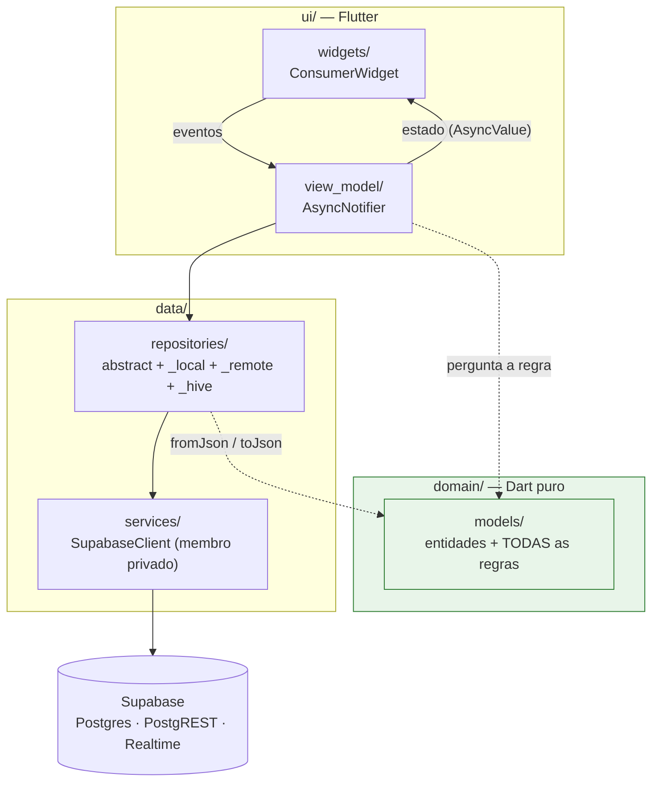

# Lista de Compras

**PWA em Flutter Web para dois iPhones.** Um casal quer saber quanto gasta em quê, não
esquecer item no corredor e não pagar caro. Do levantamento de requisitos ao deploy em
produção, escrito por uma pessoa só.

<p>
  
  
  
  
  
  
  
</p>

<!-- ---------------------------------------------------------------------------
     Ambiente de DEV/preview. Mantido aqui por decisão do autor.

     Lembrete para quando `dev` ganhar projeto Supabase próprio: hoje os
     secrets SUPABASE_URL_DEV e SUPABASE_ANON_KEY_DEV repetem os de `prod`
     (a org está no teto de dois projetos do plano Free), então este link
     escreve na MESMA base que `main`. O app não tem login e a policy do RLS
     é permissiva — quem abre o link lê e escreve. Quando `dev` nascer, nada
     neste README muda: os dois secrets deixam de repetir o par de produção.
--------------------------------------------------------------------------- -->
**[▶ Abrir o app](https://shopping-list-ci3.pages.dev)** · ambiente de demonstração.
Instale pelo Safari em *Compartilhar → Adicionar à Tela de Início* — foi desenhado para o
PWA instalado, não para aba de navegador.

---

## Para quem está avaliando meu trabalho

Se você tem cinco minutos, estes são os quatro lugares que mostram mais:

| Vá direto a | O que você vê ali |
|---|---|
| [`.claude/rules/inviolable-rules.md`](.claude/rules/inviolable-rules.md) | As 17 regras de arquitetura que o projeto inteiro obedece — escritas antes do código, não depois |
| [`lib/domain/models/`](lib/domain/models) | 41 arquivos de Dart puro. Nenhum importa `flutter`, `http` ou `supabase`. É onde mora toda regra de negócio |
| [`.claude/rules/equality-chain.md`](.claude/rules/equality-chain.md) | Por que este projeto recusa `freezed` e `equatable`, com o raciocínio inteiro e o critério de quando reabrir a decisão |
| [`docs/requisitos-lista-de-compras.md`](docs/requisitos-lista-de-compras.md) | O documento que o cliente lê: 18 requisitos essenciais em linguagem de negócio, sem uma linha de jargão técnico |

E se você tem trinta segundos: `flutter analyze` limpo, **109 arquivos de teste**,
**94,2% de cobertura de linha**, e um CI que **reprova o merge abaixo de 90%**.

---

## Sumário

- [O problema](#o-problema)
- [O que o app faz](#o-que-o-app-faz)
- [Arquitetura](#arquitetura)
- [Decisões de engenharia que valem uma conversa](#decisões-de-engenharia-que-valem-uma-conversa)
- [Qualidade](#qualidade)
- [Backend](#backend)
- [CI/CD](#cicd)
- [Como rodar](#como-rodar)
- [O processo](#o-processo)
- [Telas](#telas)
- [Estrutura de pastas](#estrutura-de-pastas)
- [Licença](#licença)
- [Sobre o autor](#sobre-o-autor)

---

## O problema

Três dores, apontadas pelo cliente como igualmente importantes:

1. **Não saber se está pagando caro** em um item.
2. **Esquecer item** na hora da compra.
3. **Não saber para onde foi o dinheiro** no fim do mês.

A lista morava metade no papel, metade na cabeça, e não seguia a ordem das prateleiras.
Os cupons de papel já tinham sido tentados e o hábito morreu — então a restrição que
governou o projeto inteiro é: **lançar uma compra inteira tem de levar até 2 minutos.**
Se der trabalho, o app morre igual aos cupons.

Duas pessoas, dois iPhones, sem login, com uma base única. A régua de tela é o
**iPhone 12 — 390 × 844 pontos**, com o teclado aberto.

---

## O que o app faz

**Onze telas**, todas entregues — as 19 histórias estão fechadas, e com elas os 18
requisitos essenciais.

| Tela | O que resolve |
|---|---|
| **Lista de compras** | Itens **agrupados por categoria** para diminuir o zigue-zague no corredor. Compartilhada em tempo real entre os dois celulares |
| **Sugestões** | O que costumam comprar, calculado a partir do **consumo dos últimos meses** |
| **Lançar compra** | Data, mercado, produto, quantidade e valor pago. Rascunho salvo no aparelho; **compra pendente sobe sozinha** quando o sinal volta |
| **Calculadora de custo proporcional** | Painel dentro do lançamento: qual embalagem sai mais barata **por unidade base**, com empate técnico de 1% |
| **Cadastro de produto** | A hierarquia de cinco níveis: categoria → tipo → marca → descrição → **embalagem** |
| **Relatórios** | Gasto e consumo por período livre, por **categoria → tipo → marca**, com o peso percentual de cada nível |
| **Falta comprar no mês** | Quanto ainda falta, contra a **média mensal de consumo** |
| **Histórico de compras** | Paginado, com quem lançou cada uma |
| **Correção de compra** | Corrigir ou apagar uma compra já lançada — **desfazendo a baixa** que ela deu na lista |
| **Manutenção do cadastro** | Renomear, reclassificar, desativar e reativar os seis cadastros |
| **Ajustes** | O **teto de gasto do mês** (aviso em 80% e em 100%) e a etiqueta de quem usa o aparelho |

Mais: **alerta de alta de preço** contra a média ponderada de uma janela rolante de três
meses, **comparação entre mercados** onde já compraram, e **aviso de item já comprado pelo
outro no mesmo dia**.

---

## Arquitetura

**MVVM do guia oficial do Flutter**, com Riverpod 3 **escrito à mão** — sem `@riverpod`,
sem `riverpod_annotation`, sem `build_runner`.



**A regra de dependência, em uma linha:** `domain/` não importa `flutter`, `http`, `dio`
nem `supabase`. É Dart puro, testável sem `flutter_test`, e é onde mora **toda** regra de
negócio. O `flutter analyze` do CI roda **antes** dos testes justamente porque é ele quem
pega um import de `package:flutter/…` dentro do domínio — nenhum teste notaria.

### As regras invioláveis, resumidas

São 17, e estão inteiras em [`.claude/rules/inviolable-rules.md`](.claude/rules/inviolable-rules.md).
As que mais moldaram o código:

- **ViewModel não importa `material.dart` e não recebe `BuildContext`.** Navegação e
  SnackBar são reação da View ao retorno do método.
- **Widget nunca chama repository.** Repository só faz I/O — nenhuma decisão de negócio ali.
- **Transição de status é regra:** `purchase.canceled()` na entidade, nunca
  `copyWith(status: …)` espalhado por aí.
- **View pergunta a regra** (`x.canSomething(now)`), nunca a reimplementa. `if` composto
  sobre campos de entidade dentro de um `build()` é bug de arquitetura.
- **Toda ação tem guarda de reentrância** — sem ela, um toque duplo dispara duas requisições.
- **Nunca interpolar a exceção na mensagem do usuário.** A falha é classificada num
  `sealed AppFailure` antes de virar frase; o detalhe cru vai para `debugPrint`.
- **`DateTime.now()` não desce para o domínio nem para o widget.** O instante nasce no
  ViewModel e viaja como parâmetro — valor novo a cada frame anularia o `==` e a tela
  repintaria sem parar.

---

## Decisões de engenharia que valem uma conversa

Cada uma destas está registrada com o raciocínio inteiro em
[`docs/decisoes-divergencias.md`](docs/decisoes-divergencias.md) e nas regras de
`.claude/rules/`. São ~50 decisões; estas seis são as que eu levaria para uma entrevista.

<details>
<summary><b>1. Por que não <code>freezed</code> nem <code>equatable</code> — "a corrente da igualdade"</b></summary>

<br>

O Riverpod filtra rebuild por `==`. Uma entidade com `==` incompleto faz a tela repintar a
cada refresh, **sem nenhum erro aparecer**. A pergunta óbvia é se algum pacote poupa o
trabalho, e a resposta é que a igualdade é uma corrente de três elos com donos diferentes:

```
AsyncData<CatalogOptions>.==  →  CatalogOptions.==  →  IList.==  →  Category.==
     (Riverpod, pronto)             (À MÃO)           (FIC, pronto)   (À MÃO)
```

`equatable` **não elimina o erro**: o `props` é uma lista escrita à mão, e esquecer um
campo ali é o mesmo esquecimento. Troca linhas por risco idêntico. `freezed` **elimina**,
porque o gerador enumera os campos sozinho — mas traz de volta o `build_runner` que a
stack recusou, e criaria duas convenções no mesmo repositório.

**O que de fato pega o campo esquecido é o teste:** duas instâncias iguais são `==` e têm o
mesmo `hashCode`, mais um caso trocando **um** campo por vez. E a decisão tem critério de
reabertura escrito: se o número de classes com `==` manual passar de 40–50, a conta muda.

[→ `.claude/rules/equality-chain.md`](.claude/rules/equality-chain.md)
</details>

<details>
<summary><b>2. Dinheiro e percentual nunca são <code>double</code></b></summary>

<br>

`Money` é um value object fino sobre `int cents`. Percentual é **inteiro em décimos de
ponto percentual**, 0 a 1000. No Postgres, `numeric`. Conteúdo de embalagem é comparado em
**inteiros na menor unidade**, e o arredondamento acontece só na formatação.

O pacote de 2,3 kg de sabão em pó por R$ 33,00 entra como 2,3 kg — R$ 14,3478 o quilo nas
contas, R$ 14,35 na tela. Se o arredondamento subisse para a conta, o relatório do mês
fecharia com centavos que não existem.

A consequência aparece até onde ninguém esperaria. O aviso de teto de gasto dispara em 80%
e em 100%, e a comparação é feita **sem divisão nenhuma**: `spent / cap >= percent / 100`
vira `spent.cents * 100 >= cap.cents * percent`. Inteiro dos dois lados, sem um `double`
para arredondar o gasto para baixo justamente na linha que decide se o casal é avisado.
</details>

<details>
<summary><b>3. <code>Record</code> é proibido no projeto inteiro</b></summary>

<br>

Um `({String? error, T? payload})` representa **4 estados para 2 válidos**, e não existe
`switch` exaustivo sobre record. O projeto tinha 15 deles; um plano específico os converteu
em 12 `final class` mais 2 hierarquias `sealed`.

Isso não é teoria: o `CatalogViewModel.save` devolvia `(error: null, saved: null)` quando a
guarda de reentrância disparava, e a tela lia isso como sucesso — dizia *"Produto salvo."*
e saía da tela **sem ter salvo nada**. A causa foi removida junto com o sintoma.

A forma do retorno de uma ação sai do **número de desfechos**: dois sem carga é
`Future<String?>` (`null` = deu certo); dois com carga, ou três ou mais, é um `sealed` local
ao ViewModel com retorno anulável.

A verificação de que nenhum record voltou é um grep de **literais**, não de `^typedef` — um
record de tipo inferido não tem `({...})` escrito em lugar nenhum.
</details>

<details>
<summary><b>4. O tradutor de erro do Supabase — o SQLSTATE que virava "servidor indisponível"</b></summary>

<br>

O PostgREST põe o **SQLSTATE** no campo `code`, não um status HTTP. O `'23505'` — a trava de
duplicidade do cadastro — lido como número vira "status 23505", cai no ramo `>= 500`, e o
usuário lê *"o servidor está indisponível"* quando o que houve foi *"esse produto já
existe"*.

Todo método `_remote` fecha seu I/O com `rethrowAsKnownFailure(e, st)`, e cada SQLSTATE
mapeado tem teste. [→ `.claude/rules/supabase-error.md`](.claude/rules/supabase-error.md)
</details>

<details>
<summary><b>5. Offline sem <code>connectivity_plus</code></b></summary>

<br>

É PWA. Os eventos `online`/`offline` do navegador chegam pelo pacote `web`, que o SDK já
traz, atrás de um *conditional import* — e a reconexão do canal do Supabase é o segundo
sinal. Uma dependência a menos, e um `Timer` de polling a menos acordando o WebKit à toa.
</details>

<details>
<summary><b>6. Todo campo digitável fica no topo da tela</b></summary>

<br>

Numa altura de 844 pontos, o teclado do iPhone leva perto da metade. O campo que estava no
meio da tela vai parar embaixo dele — e **`padding` não resolve**: padding acomoda o
conteúdo no espaço que ainda existe, e o problema é que o espaço deixou de existir. Quem
resolve é a **ordem** dos elementos.

A regra tem duas exceções declaradas, e cada uma exige algo em troca. Campo dentro de linha
repetível não tem topo — em troca, a área que rola termina onde o teclado começa, e existe
um teste chamado `with the keyboard up no line falls under it` que falha se aquele
`padding` for removido.

[→ `.claude/rules/ui-conventions.md`](.claude/rules/ui-conventions.md)
</details>

**Outras, mais curtas:** nenhum limiar numérico no SQL (o Postgres soma e agrupa; toda regra
é Dart) · nenhum `now()` ou `current_date` no SQL · soft delete nos seis cadastros, porque
renomear vale para todo o histórico · a trava de duplicidade compara **normalizado** — sem
maiúsculas, sem espaço sobrando, sem acento — e **quem responde ao usuário é o Dart**, com o
índice único como rede embaixo · a lista **nunca se mexe debaixo do dedo**: o que chega do
outro celular entra por uma faixa de aviso, e é o toque dela que refaz a tela.

---

## Qualidade

| | |
|---|---|
| Arquivos de produção | **146** (23.653 linhas) |
| Arquivos de teste | **109** (28.012 linhas) |
| Casos de teste | **1.376** declarações `test`/`testWidgets`, em 218 grupos |
| Cobertura de linha | **94,2%** (7.205 / 7.649) |
| Piso reprovando o CI | **90,0%** |
| `flutter analyze` | limpo — e **zero `// ignore`** em `lib/` |

**Mais linhas de teste do que de produção**, e isso é consequência da doutrina, não coincidência.

### O que é obrigatório testar

- **Regra de negócio:** teste puro em `test/domain/`, incluindo os **limites** — exatamente
  no prazo, exatamente encostado — e **toda** transição de status, mesmo a que a tela ainda
  não chama.
- **ViewModel:** os **dois** caminhos de erro (com e sem dado anterior), o `refresh()` que
  dá certo, a classificação de cada status em `AppFailure`, o **toque duplo** e o
  desembrulho de `ProviderException` — os dois últimos precisam **falhar** se a guarda ou o
  laço forem removidos.
- **Nunca `DateTime.now()` em teste.** Instante fixo, sempre.

### Rodando

O escopo mínimo é a regra: a suíte inteira leva minutos e só roda antes de fechar uma entrega.

```bash
flutter test test/domain/purchase_test.dart            # um arquivo
flutter test test/domain/                              # uma pasta
flutter test test/ui/catalog_view_model_test.dart --name 'guards against double tap'

grep -rl 'PurchaseItem' test/ | xargs -r flutter test  # tudo que toca um símbolo

flutter analyze lib/domain/models/purchase.dart        # analyze também aceita caminho
```

Cobertura parcial vai sempre para um arquivo separado — sem `--coverage-path`, o
`--coverage` **sobrescreve** `coverage/lcov.info` com as bibliotecas de um teste só, e a
conta do projeto passa a mentir para menos sem nenhum aviso:

```bash
flutter test --coverage --coverage-path coverage/scoped.info test/domain/purchase_test.dart
```

Suíte completa, do jeito que o CI roda:

```bash
flutter analyze && flutter test --coverage
```

---

## Backend

**Supabase** — Postgres, PostgREST e Realtime. Sem backend próprio, sem camada intermediária.

- **9 migrations versionadas** em [`supabase/migrations/`](supabase/migrations), em ordem de
  aplicação.
- **12 tabelas** com soft delete nos seis cadastros, índices únicos sobre o nome
  **normalizado**, e índices parciais para os itens abertos da lista.
- **11 funções**, e as transacionais estão ali porque uma compra precisa ser atômica:
  `create_purchase`, `update_purchase` e `delete_purchase` gravam a compra, seus itens e a
  baixa que ela dá na lista numa transação só. As de leitura — `report_period`,
  `type_consumption`, `cap_states`, `same_day_types` — devolvem agregação plana, e é o Dart
  que a transforma em árvore.
- **RLS ligado, com policy permissiva** — e isso não é contradição. Não há login, a chave
  anônima é pública e a barreira é a URL não divulgada (decisão 6, risco aceito por
  escrito). Deixar RLS **desligado** num projeto Supabase faz o PostgREST recusar tudo por
  outro caminho, e o app leria *"o servidor recusou o acesso a este dado"* sem nada na tela
  nem no schema explicando por quê. Ligado e permissivo é a forma honesta de dizer "quem
  tem a chave lê e escreve".
- **Realtime** no canal da lista de compras, com o descarte do próprio eco — senão o
  aparelho que escreveu repinta a tela com o que ele mesmo acabou de mandar.

**O SQL soma e agrupa; ele não decide.** Nenhum limiar numérico e nenhum `current_date`
moram lá — se morassem, mudar o alerta de alta de preço viraria uma migration em vez de uma
constante no domínio.

Os cenários de cada função ficam em [`supabase/checks/`](supabase/checks), rodados por
`tool/checks.sh`. Cinco dos seis arquivos envolvem tudo em `begin; … rollback;`, então uma
execução não deixa rastro.

---

## CI/CD

[`.github/workflows/deploy.yml`](.github/workflows/deploy.yml) — GitHub Actions →
Cloudflare Pages, em **todo push de toda branch**.

```
checkout → flutter pub get → flutter analyze → flutter test --coverage
         → piso de 90% (reprova abaixo) → flutter build web → wrangler pages deploy
```

Três coisas que esse arquivo resolve e que costumam passar despercebidas:

- **`analyze` antes de `test`**, porque é ele quem pega o import proibido dentro do domínio.
- **`main` publica em produção; qualquer outra branch publica um preview** contra a base
  descartável. A URL de preview é adivinhável (`<hash>.<projeto>.pages.dev`), e uma URL não
  divulgada é a única barreira que este sistema tem — então o que fica atrás de uma URL
  adivinhável tem de ser a base que se pode jogar fora.
- **Credencial ausente pula a publicação em vez de reprovar.** Analyze, teste e build ainda
  rodam e ainda guardam o push, que era o que mantinha o workflow útil enquanto o deploy
  não existia. Um `if:` de step **não enxerga o `env:` do próprio step** — a decisão de
  publicar é tomada dentro de um script e viaja como `output`. Isso custou dois runs verdes
  que não provavam nada.

Sem credencial de Supabase, o build mostra uma tela `MisconfiguredApp` — não uma tela branca.

---

## Como rodar

**Pré-requisitos:** Flutter 3.44.0 stable · Dart 3.12.0.

### 1. Com dados falsos — não precisa de nada

```bash
flutter pub get
flutter run -d chrome
```

Sem os dois `--dart-define`, o app cai nos repositories `_local` (dados falsos com ~400 ms
de latência simulada) e mostra a faixa **DADOS FAKE**. É o modo em que a suíte de testes roda.

### 2. Contra um Postgres local

Postgres nativo + PostgREST + Caddy, sem Docker:

```bash
brew services start postgresql@17
uv run tool/local_dev/setup.py     # escreve os configs e o .env local
tool/local_dev/run.sh              # sobe a API e abre o app no Chrome
```

`tool/local_dev/up.sh` sobe só a API, em `http://127.0.0.1:54321/rest/v1`.

### 3. Contra um projeto Supabase hospedado

```bash
cp .env.example .env               # preencha SUPABASE_URL e SUPABASE_ANON_KEY

flutter run -d chrome \
  --dart-define=SUPABASE_URL="$SUPABASE_URL" \
  --dart-define=SUPABASE_ANON_KEY="$SUPABASE_ANON_KEY"
```

> **Teste sempre no PWA instalado na tela de início, nunca em aba.** O armazenamento é
> separado, e um deploy só passa a valer na abertura seguinte do app.

---

## O processo

O cliente não é técnico. O projeto começou por uma **entrevista de levantamento de
requisitos** conduzida inteiramente em linguagem de negócio, e só depois virou código. Os
documentos são fonte da verdade, em ordem de precedência — onde o código diverge deles, é o
código que está errado.

| Documento | O que é |
|---|---|
| [`docs/requisitos-lista-de-compras.md`](docs/requisitos-lista-de-compras.md) | **18 requisitos essenciais.** É o que o cliente lê. Problema, objetivos, critérios de sucesso, regras de negócio, limites e pontos em aberto |
| [`docs/tecnico-lista-de-compras.md`](docs/tecnico-lista-de-compras.md) | Questionário técnico. **25 decisões congeladas** — mudar uma é alteração de escopo, não de implementação |
| [`docs/wireframes-lista-de-compras.md`](docs/wireframes-lista-de-compras.md) | 6 telas, 6 diálogos e o painel da calculadora, na medida do iPhone 12 |
| [`docs/handoff-lista-de-compras.md`](docs/handoff-lista-de-compras.md) | **19 histórias (H1–H19)**, ordem de entrega e o glossário do negócio |
| [`docs/decisoes-divergencias.md`](docs/decisoes-divergencias.md) | As ~50 decisões A–I em vigor no código, com o motivo de cada uma |
| [`docs/historico-entregas.md`](docs/historico-entregas.md) | O que cada entrega mudou **fora** das telas dela, e a armadilha que revelou |
| [`docs/estado-atual.md`](docs/estado-atual.md) | O que existe hoje, história por história |

**As 19 histórias estão fechadas, e com elas os 18 requisitos essenciais.** As entregas 10,
11 e 12 são acréscimos pedidos depois.

### Glossário obrigatório

Todo termo de negócio tem uma tradução única para o código, registrada em
[`.claude/rules/glossary.md`](.claude/rules/glossary.md) antes de virar arquivo. Sem isso,
"fatura" vira `Invoice` numa feature e `Bill` na seguinte — as duas em inglês correto, então
nenhuma verificação automática acusa, e o custo de unificar cresce a cada feature.

O código é todo em **inglês americano**; **só o texto que o usuário lê** é português do
Brasil, e escrito para leigo — sem `token`, sem `cache`, sem `sincronizar`.

---

## Telas

<!-- ===========================================================================
     DESCOMENTE ESTE BLOCO depois de salvar os seis PNG em docs/screenshots/
     (nomes em docs/screenshots/README.md). Prints tirados no PWA instalado,
     iPhone 12, 390 x 844 pontos. Comentado por enquanto para o README nao ser
     publicado com seis imagens quebradas.

| Lista no corredor | Lançar compra | Relatório do período |
|:---:|:---:|:---:|
|  |  |  |
| Itens agrupados por categoria, sincronizados entre os dois aparelhos | Mercado, produto, quantidade e valor pago — a meta são 2 minutos | Categoria → tipo → marca, com o peso percentual de cada nível |

| Calculadora de custo | Falta comprar no mês | Cadastro de produto |
|:---:|:---:|:---:|
|  |  |  |
| Qual embalagem sai mais barata por unidade base, com empate técnico de 1% | O consumido no mês contra a média mensal | Categoria → tipo → marca → descrição → embalagem |

============================================================================ -->

> **Prints em preparo.** As seis telas principais são: a lista agrupada por categoria, o
> lançamento de compra, o relatório por categoria → tipo → marca, a calculadora de custo
> proporcional, o "falta comprar no mês" e o cadastro de produto em cinco níveis.

---

## Estrutura de pastas

```
lib/
├── config/          dependencies.dart (providers de infra + overrides) e environment.dart
├── routing/         routes.dart (11 paths) e router.dart (GoRouter)
├── domain/
│   ├── models/      41 arquivos. Entidades, TODAS as regras e as exceções de regra. Dart puro
│   └── use_cases/   VAZIA de propósito: só nasce com 2+ repositories ou 2+ ViewModels
├── data/
│   ├── repositories/<feature>/   abstract + _local (fake) + _remote (Supabase) + _hive
│   └── services/                 cliente e tradutor de erro. Sempre membro privado do repository
└── ui/
    ├── core/                     tema, AppFailure, tradução de erro, MessageView, MainMenu
    └── <feature>/
        ├── view_model/           orquestração e estado (AsyncNotifier)
        └── widgets/              telas e componentes (ConsumerWidget)

supabase/migrations/   9 migrations versionadas
supabase/checks/       6 arquivos de cenário SQL, rodados por tool/checks.sh
docs/                  requisitos, técnico, wireframes, handoff, decisões, histórico
.claude/rules/         16 arquivos de regra de arquitetura, um por assunto
tool/local_dev/        Postgres + PostgREST + Caddy locais, sem Docker
```

### Dependências de runtime, e nada além disto

| Pacote | Para quê |
|---|---|
| `supabase_flutter` | Backend inteiro: Postgres, PostgREST e Realtime |
| `flutter_riverpod` 3.x | Estado e injeção de dependência, escrito à mão |
| `go_router` | As 11 rotas nomeadas |
| `hive_ce` + `hive_ce_flutter` | Duas coisas só: o rascunho da compra e a etiqueta de quem usa o aparelho |
| `intl` + `flutter_localizations` | Formatação e delegates pt-BR |
| `fast_immutable_collections` | `IList` em toda coleção — o `==` de `List` compara por referência |
| `http` | Só pelo `ClientException`, que é como falha de transporte chega |
| `web` | Só os eventos `online`/`offline`, atrás de conditional import |

Em desenvolvimento: `flutter_test`, `mocktail`, `flutter_lints` ^6.0.0. **A lista é
congelada** — acrescentar um pacote é decisão registrada, não conveniência.

---

## Licença

[MIT](LICENSE) — use, copie, modifique e distribua à vontade, inclusive
comercialmente, mantendo o aviso de copyright.

Duas coisas que a licença **não** cobre, e é bom dizer em voz alta:

- **O conteúdo de `docs/`** nasceu de entrevistas com um cliente real. Está aqui como
  demonstração de método, não como modelo para copiar e entregar a outro cliente.
- **A base do ambiente de demonstração** é um Supabase sem login, com policy permissiva.
  Se você for rodar isto para valer, use um projeto seu — e leia a decisão 6 antes, em
  [`supabase/migrations/20260827090200_rls.sql`](supabase/migrations/20260827090200_rls.sql).

---

## Sobre o autor

**Leandro Rocha de Brito** — Desenvolvedor Mobile Flutter Sênior · 100% remoto

📧 [leandrorochaadm@gmail.com](mailto:leandrorochaadm@gmail.com) ·
💼 [linkedin.com/in/leandrorochaadm](https://www.linkedin.com/in/leandrorochaadm) ·
🐙 [github.com/leandrorochaadm](https://github.com/leandrorochaadm) ·
📱 [(11) 99711-8447](https://wa.me/5511997118447)

São **6 anos de desenvolvimento, mais de 4 deles em Flutter**, em e-commerce, saúde e
fintech — incluindo o módulo de seguros e assistências técnicas da **Claro Pay** e o app da
**Monetizze**, os dois com **1M+ downloads**. No projeto mais recente, uma healthtech de
telemedicina, assumi um MVP **sem nenhum teste automatizado e sem code review**, defini a
estratégia de testes que o time adotou e **conduzi a migração de multirepo para monorepo**
em Dart Workspace, com 31 módulos de negócio em packages.

Este repositório é um sistema de uso real — cliente de verdade, dor de verdade, publicado e
rodando — e não um exercício de portfólio. Ele está aqui porque mostra, em tamanho pequeno o
bastante para ser lido inteiro, o que eu acho que separa um app que funciona de um app que
continua funcionando dois anos depois: **a decisão escrita antes do código, e o teste que
impede essa decisão de ser desfeita por engano.**

Aqui eu fui cliente, analista, desenvolvedor e homologador. Num time, o valor é o mesmo em
qualquer uma dessas cadeiras: transformar conversa em requisito, requisito em regra testável,
e regra testável em algo que o próximo desenvolvedor não consegue quebrar sem o CI avisar.

**O que eu levaria para uma conversa:**

- Conduzir o levantamento de requisitos com quem entende do negócio e não de software — e
  transformar isso em documento que o cliente **lê e valida**, não em ticket.
- Escolher uma arquitetura e **fazê-la valer** com regra escrita, lint e teste, em vez de
  confiar em disciplina. Foi o que fiz na healthtech, onde a estratégia de testes que
  defini levou o produto do piloto ao pré-lançamento.
- Saber recusar uma abstração. `freezed`, `equatable`, `Result<T>` e DTO separado da
  entidade não têm um único uso aqui, e cada ausência tem o motivo e o critério de
  reabertura escritos. A pasta `domain/use_cases/` existe e está **vazia**, com um
  `.gitkeep`: a regra diz que ela só nasce quando a lógica usar 2+ repositories ou se
  repetir em 2+ ViewModels, e em 19 histórias isso não aconteceu nenhuma vez.
- Escrever o SQL, a migration, o RLS e o pipeline — não só a tela.

**Outro projeto no mesmo espírito:** [**Lions Pontos**](https://github.com/leandrorochaadm/lions-club-points)
— plataforma multi-clube que apura em tempo real o prêmio de associado mais atuante de clubes
de serviço, substituindo apuração manual em atas de papel. Flutter Web (PWA) + Supabase com
modelagem **multi-tenant** e isolamento por **Row Level Security no banco**, deploy em
Cloudflare Workers, Sentry e PostHog em produção. Desenvolvo e opero como **voluntário** para
o Lions Clube de Ji-Paraná/RO. [Demo](https://lions-pontos.tektonsoftwares.workers.dev/demo).

---

**Disponível para posições de Flutter.** Se algo aqui levantou uma pergunta, ela é a melhor
forma de começar a conversa — [e-mail](mailto:leandrorochaadm@gmail.com) ou
[LinkedIn](https://www.linkedin.com/in/leandrorochaadm).
