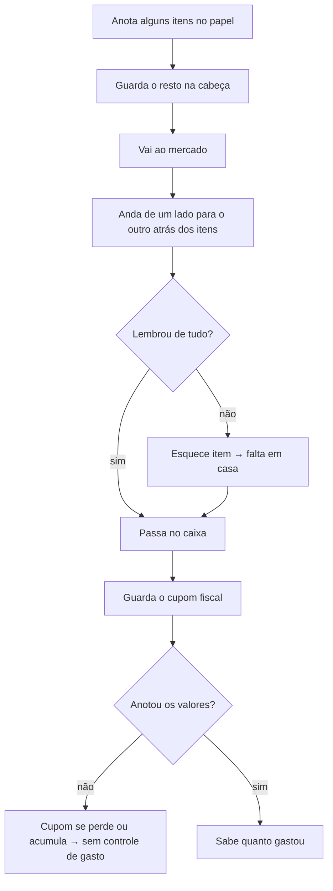

# Requisitos — Lista de compras de supermercado

_Levantado em 15/08/2026 · Última atualização em 27/08/2026_
_Entrevistado: Leandro Rocha (dono do processo de compras)_

## Problema e objetivos

Três dores foram apontadas como igualmente importantes:

- Não saber se está pagando caro em um item.
- Esquecer item na hora da compra.
- Não saber para onde foi o dinheiro no fim do mês.

O que faz ele querer abrir o sistema depois da compra: a necessidade de saber
quanto consumiu, ver para onde está indo o dinheiro e onde está havendo
desperdício. Por isso o lançamento precisa ser **sem fricção** — se der trabalho,
o hábito morre, como já morreu com os cupons de papel.

**Vamos saber que deu certo quando:**

- Lançar uma compra inteira levar **até 2 minutos**, com os produtos de sempre já
  sugeridos e o preço anterior já preenchido — ele só confirma ou corrige.
- Ele conseguir responder, a qualquer momento e para o período que escolher,
  quanto gastou por categoria, por tipo de produto e quanto consumiu de cada
  produto.

**"Desperdício", para ele, é enxergar três coisas:**

1. Produto que subiu de preço em relação às compras anteriores.
2. Produto que sai mais barato em outro mercado onde ele já comprou.
3. Categoria que está pesando demais no total do mês.

Um quarto sinal — "o que comprei sem estar na lista" — foi levantado e depois
descartado por ele: item fora da lista entra igual aos outros, e ele abre mão do
relatório de compra por impulso para não ganhar trabalho no lançamento.

## Como funciona hoje

A lista mora metade no papel, metade na cabeça. No mercado, ele anda "para lá e
para cá" atrás de cada item, porque a lista não segue a ordem das prateleiras.
Às vezes esquece de comprar coisas, e às vezes esquece de anotar coisas na lista
antes de sair de casa.

O cupom fiscal ele guarda, mas acaba perdendo. Quando não perde, os cupons vão
acumulando e bate a preguiça de sentar e anotar os valores. Resultado: hoje ele
não consegue responder quanto gastou em um tipo de produto no mês passado.

**O que dói:** o zigue-zague no corredor, o esquecimento de itens e o registro
manual dos valores depois da compra.

## Pessoas envolvidas

| Quem | O que faz | Decide/aprova algo? |
|------|-----------|---------------------|
| Leandro | Monta a lista, compra, lança as compras e cadastra produto novo na hora do lançamento | Sim — define o vocabulário oficial: categorias, tipos e nomes dos produtos |
| Esposa | Vê e marca a lista, adiciona itens, lança as compras dela e cadastra produto novo na hora do lançamento | Sim — decide o que entra na lista |

Os dois têm os mesmos poderes no sistema: qualquer um cadastra categoria, tipo e
produto, e qualquer um lança e corrige compra. A diferença é de
combinado, não de permissão — quem organiza o vocabulário é ele.

São várias idas ao supermercado por mês, feitas pelos dois. Esse é um dos
motivos de precisarem de uma lista comum: sem ela, um não sabe o que o outro já
comprou.

Outro objetivo apareceu aqui: saber **com precisão o que foi comprado no mês
anterior** para estimar quanto precisa comprar no mês atual — ou seja, o
histórico serve de base para planejar a lista do mês seguinte.

## Requisitos

Ele decidiu que **tudo entra na 1ª versão**, incluindo a lista sugerida a partir
do consumo dos últimos meses. Como não há prazo, a decisão é dele; a consequência
registrada é que a primeira entrega útil demora mais a ficar pronta, e que as
comparações de preço só mostram algo de valor depois de alguns meses de compras
lançadas — isso é da natureza delas, não do sistema.

### Essencial (1ª versão)

1. **Cadastrar produtos na hierarquia de cinco níveis**, no vocabulário dele:
   **categoria → tipo do produto → marca → descrição → embalagem**. Exemplo:
   "Limpeza" → "sabão em pó" → "Omo" → "lavagem perfeita" → "500 g".
   - **A marca é cadastrada, como o mercado; a descrição é campo livre.** A marca
     agrupa e compara preço, e por isso é **escolhida de uma lista das marcas já
     cadastradas, nunca digitada solta** — "Omo" e "OMO" digitados em dias
     diferentes partiriam o histórico de preço da marca em dois, e o relatório
     por marca passaria a somar errado. Marca nova é cadastrada na hora, dentro
     do próprio cadastro do produto e sem sair da tela, do mesmo jeito que o
     mercado novo nasce dentro do lançamento — e **o cadastro dela recusa nome
     repetido**, pela mesma comparação do tipo: ignorando maiúsculas, espaço
     sobrando e acento. Sem essa recusa, escolher da lista impediria só o erro de
     digitação dentro do produto; nada impediria "Omo" e "OMO" de nascerem como
     duas marcas em dias diferentes, que é exatamente o estrago que fez a marca
     virar cadastro.
   - **Categoria e tipo também nascem dentro do cadastro do produto** (decisão de
     26/08/2026), pelo mesmo botão que a marca já tem ao lado. A categoria abre um
     diálogo de um campo só; o tipo abre o mesmo mini-cadastro do requisito 2 —
     nome, categoria e unidade base. Sem eles, a primeira compra de uma categoria
     que ainda não existe — a primeira fralda, o primeiro item de padaria —
     travaria com o cupom na mão: ele teria de sair do lançamento, criar o tipo
     pela lista e voltar, perdendo o que já tinha digitado. É a mesma regra que
     vale para marca e mercado: o cadastro que faltou nasce onde deu falta.
   - A **descrição continua sendo campo livre**, digitada, e é o único nível da
     classificação que não precisa de cadastro. Ela **não soma, não compara
     preço e não aparece em relatório** — mas, desde 26/08/2026, **separa um
     cadastro do outro**: é ela que faz "Coca-Cola zero" e "Coca-Cola original"
     serem dois produtos. Para que isso não recrie pela porta dos fundos o
     problema que o cadastro de marca resolveu, o campo **sugere as descrições
     já usadas naquele tipo e naquela marca** enquanto ele digita, e a
     comparação entre duas descrições **ignora maiúsculas, espaço sobrando e
     acento**
     ("Original" e "original " são a mesma). Escrever "orig." e criar um segundo
     cadastro continua sendo possível; a sugestão existe para que não seja
     preciso.
   - **O cadastro diz como o produto é vendido:** *a peso* (acém moído, tomate,
     pão francês) ou *por peça* (Omo 500g, lata 350 ml). É essa marcação que faz
     o lançamento pedir o peso do cupom ou a quantidade de embalagens — o
     sistema não adivinha. Sem ela, o ovo vendido à dúzia, que também não tem
     marca nem peso de peça, acabaria pedindo quilos.
   - **Marca e descrição são opcionais; a embalagem depende de como o produto é
     vendido.** Produto **por peça** tem sempre pelo menos uma embalagem — sem
     ela não há como converter a compra para a unidade base. Produto **a peso**
     não tem nenhuma: quem informa a quantidade é o lançamento. Ter marca e ser
     vendido a peso continuam sendo coisas separadas. O acém moído para em
     "Carnes" → "acém moído": não tem marca de fábrica nem embalagem fechada. Já
     a mussarela fatiada no balcão é vendida a peso **e tem marca** ("Frios" →
     "mussarela" → "Tirolez"), e é assim que ela é comparada contra ela mesma, e
     não contra a mussarela mais barata do balcão.
   - **O quinto nível é a embalagem**, escrita como **quantas peças vêm nela ×
     quanto tem cada peça**, e é esse mesmo texto que vira o nome dela na tela:
     **500ml**, **2L**, **12x350ml**. Em tipo medido em unidade a medida não
     existe e sobra só a contagem: **12un** na cartela de ovo. Embalagem de uma
     peça só é o caso comum, e nela o "1 ×" nem aparece.
   - **Nenhum rótulo classifica a embalagem.** O cadastro não tem campo para
     dizer "fardo", "pacote" ou "caixa": "12x350ml" já informa que vêm 12 peças
     de 350 ml, e é isso que ele precisa saber na prateleira. Um rótulo a mais
     seria mais uma escolha no cadastro sem nada em troca.
   - O **conteúdo total** — 4,2 litros em "12x350ml" — o sistema calcula sozinho;
     ele nunca digita esse número.
   - **Um cadastro cria várias embalagens de uma vez.** Categoria, tipo, marca e
     descrição são preenchidos uma única vez, e embaixo ele lista todas as
     embalagens daquele produto — lata 350 ml, lata 269 ml, garrafa 2 L, fardo
     12x350ml. Cada linha vira um produto próprio ao salvar. É o que evita
     repetir o cadastro inteiro quatro vezes para o mesmo refrigerante.
   - **Não existem dois cadastros do mesmo produto** (decisão de 26/08/2026):
     **tipo + marca + descrição** já cadastrados barram um cadastro novo, e o
     caminho passa a ser acrescentar a embalagem que falta ao produto que já
     existe (requisito 16). A descrição entra nessa identidade porque é ela que
     separa "Coca-Cola zero" de "Coca-Cola original"; em branco, também conta
     como valor — duas Coca-Cola sem descrição dentro de "refrigerante" são o
     mesmo produto. A embalagem fica de fora: ela é o que se acrescenta depois,
     não o que distingue um cadastro do outro. É a mesma proteção da marca e do
     mercado — produto duplicado parte o histórico de preço em dois, e um
     cadastro que cria quatro embalagens de uma vez multiplica por quatro a
     chance de duplicar.
   - **Cada embalagem é um produto próprio**, com preço e histórico próprios: a
     lata avulsa de 350ml e o 12x350ml são dois produtos do mesmo
     tipo. Quantas embalagens foram compradas é informado na compra, não no
     cadastro.
   - **A medida da peça é digitada com a unidade escolhida ao lado**, entre
     **g e kg** nos tipos medidos em quilo e **ml e L** nos medidos em litro.
     As quatro nunca aparecem juntas: as opções vêm da unidade base do tipo. O
     sistema converte sozinho (350 ml viram 0,35 litro) e **continua exibindo o
     que ele digitou** — "Coca-Cola 350ml" é o nome que ele reconhece na
     prateleira, não "Coca-Cola 0,35 L".
   - **Em tipo medido em unidade** (ovo, papel higiênico, sabão em barra) a
     embalagem é só a contagem de peças — "cartela de 12", "pacote de 4 rolos" —,
     porque a unidade base já é a própria peça. Uma medida pode ser anotada ao
     lado como lembrete ("30 m cada"), mas fica fora de todo cálculo e de todo
     relatório.
   - A **unidade base** (quilo, litro, unidade) é definida no tipo do produto e
     vale para tudo abaixo dele — é nela que consumo e preço são sempre contados.
     Por isso ela vem antes: **enquanto o tipo não estiver escolhido, ou a
     unidade do tipo novo não estiver definida, não há como listar embalagem** —
     o sistema não saberia quais medidas oferecer.
   - _Pronto quando:_ ele cadastra "Limpeza / sabão em pó / Omo / lavagem
     perfeita / 500 g" e, da segunda compra em diante, escolhe esse produto
     pronto: marca, descrição e embalagem vêm juntas, sem digitar nada de novo.
   - _Pronto quando:_ ele cadastra "Carnes / acém moído", sem marca e sem
     embalagem, e o lançamento pede só o peso que ele comprou.
   - _Pronto quando:_ "Omo 500g" e "Omo 2,3kg" são dois produtos distintos, e o
     relatório de "sabão em pó" soma os dois no mesmo número.
   - _Pronto quando:_ num cadastro só, digitando "Bebidas / refrigerante /
     Coca-Cola" uma única vez, ele cria as quatro embalagens — lata 350 ml, lata
     269ml, garrafa 2L e 12x350ml — e as quatro passam a aparecer como
     produtos separados na hora de lançar.
   - _Pronto quando:_ ao salvar esse cadastro ele marca qual das quatro está
     comprando agora, e é ela que volta já selecionada no lançamento.
   - _Pronto quando:_ no refrigerante ele digita "350" e a lista de medidas
     oferece **só ml e L**; no sabão em pó, **só g e kg**. Em nenhum dos dois ele
     consegue escolher uma medida da outra família.
   - _Pronto quando:_ o pacote digitado como "500 g" aparece como "500 g" em toda
     tela e entra no relatório de "sabão em pó" como 0,5 kg.
   - _Pronto quando:_ tendo "Coca-Cola original" já cadastrada em
     "refrigerante", ele recomeça o mesmo cadastro e o sistema barra o salvar,
     oferecendo abrir o cadastro que já existe para acrescentar a embalagem
     nova; "Coca-Cola zero", com a descrição diferente, passa normalmente.
2. **Lista de compras compartilhada entre ele e a esposa**, na qual os dois
   adicionam itens e marcam o que já pegaram.
   - **O item da lista aponta sempre um tipo de produto** ("leite") e, se quem
     escreve quiser, também a **marca** e a **embalagem** preferidas ("leite
     Italac 1 L"). As duas são opcionais e valem como lembrete, não como
     exigência: qualquer compra daquele tipo abate o item, de qualquer marca e
     qualquer embalagem — a marca continua se decidindo na prateleira.
   - **A caixa do item alterna só entre vazio e pego; "não encontrei" mora no
     diálogo de edição** (decisão de 26/08/2026), aberto ao tocar no texto do
     item. Pegar é o gesto de quase toda a compra e precisa ser um toque à prova
     de distração; "não encontrei" é raro e tem consequência — é o recado que o
     outro lê na volta, e só cai sozinho na próxima compra daquele tipo. Com a
     caixa girando três estados, o toque repetido por engano transformava item
     comprado em item não achado, sem ninguém perceber no corredor.
   - **A lista se atualiza sozinha enquanto está aberta, mas nunca mexe debaixo
     do dedo** (decisão de 26/08/2026). O que chega do outro celular não entra
     na lista de repente: aparece uma faixa no topo — "2 itens novos —
     atualizar" —, e é o toque na faixa que refaz a lista. Sem atualização
     nenhuma, o caso que dá razão ao app inteiro continuaria de pé com o
     aplicativo na mão: ele no corredor, ela adicionando de casa, e ele voltando
     sem o item. Atualizando de repente, a lista se reorganizaria bem no
     instante em que ele vai marcar alguma coisa, e o toque cairia no item
     errado — que é o mesmo motivo pelo qual a caixa deixou de girar três
     estados.
   - _Pronto quando:_ ela adiciona "leite" pelo celular dela e ele vê "leite" na
     lista dele; ele marca como pego e ela vê que ele já pegou.
   - _Pronto quando:_ com a lista aberta na mão dele, ela adiciona dois itens de
     casa: aparece a faixa "2 itens novos", nada se move sozinho, e os dois itens
     entram quando ele toca nela.
   - _Pronto quando:_ tocar duas vezes na caixa do mesmo item leva de volta ao
     vazio, e nunca a "não encontrei".
   - _Pronto quando:_ ela põe só "leite" e ele põe "leite Italac 1L" na mesma
     lista, os dois formatos convivem, e comprar Piracanjuba abate os dois.
   - **Adicionar item é uma busca sobre os tipos de produto já cadastrados,
     com a opção de criar o tipo na hora** (decisão de 26/08/2026). Ela digita
     as primeiras letras, escolhe da lista que vai filtrando e o item entra na
     lista — dois toques. Quando nada bate com o que ela digitou, a última linha
     da busca é **"Criar 'achocolatado'"**, que abre um mini-cadastro de tipo
     ali mesmo: nome, categoria e unidade base, nada mais. É o mesmo padrão do
     mercado novo dentro do lançamento, e é o que impede a lista de travar
     justamente quando ela lembra de algo que nunca compraram.
   - **O tipo não pode nascer duas vezes** (decisão de 26/08/2026). A busca
     compara **ignorando maiúsculas, espaço sobrando e acento**: quem digita
     "acem moido" ou "ACHOCOLATADO" encontra o tipo que já existe, e a linha
     "Criar '…'" simplesmente não aparece. É a mesma proteção da marca, do
     mercado e do cadastro de produto, e pelo mesmo motivo — nome escrito de dois
     jeitos parte o histórico em dois, e nenhum rename posterior junta o que
     nasceu separado. O acento entra na comparação porque é o que mais se perde
     digitando com pressa: o próprio requisito 16 nasceu do "acem moido" a
     corrigir. **Categoria segue a mesma regra**, no `[+Novo]` da categoria.
   - **Tipo desativado aparece na busca, marcado como desativado**, com a opção
     de reativar em vez de criar outro. Sem isso, o desativar — que existe
     justamente para preservar o histórico — seria o caminho mais curto para
     rachá-lo: quem der falta do tipo não o encontraria e criaria um novo com o
     mesmo nome.
   - **O item entra só com o tipo.** Quantidade, marca e embalagem preferidas
     não são pedidas aqui: elas moram no diálogo de edição, que abre depois ao
     tocar no item (requisito 13). Item sem quantidade sai da lista na primeira
     compra daquele tipo, que é o comportamento certo para "acabou o
     achocolatado".
   - **Por que o tipo é obrigatório:** a lista agrupa por categoria
     (requisito 11) e a baixa acontece pelo tipo do produto. Item sem tipo não
     teria categoria onde aparecer nem compra que o abatesse — é o mesmo motivo
     do "não fica item solto sem classificação" de "Quando dá errado".
   - _Pronto quando:_ acabou o achocolatado, que eles nunca compraram; ela toca
     em "+ Adicionar item", digita "achoc", escolhe "Criar 'achocolatado'",
     informa categoria "Mercearia" e unidade "quilo", e o item aparece na lista
     dentro do grupo Mercearia, sem ela passar pelo cadastro de produto.
   - _Pronto quando:_ ela digita "lei", escolhe "leite" da busca e o item entra
     na lista sem pedir mais nada — e a quantidade ela ajusta depois, tocando
     nele.
   - Item que não tinha no mercado continua na lista, marcado como "não
     encontrei".
3. **Lançar uma compra em até 2 minutos**, com data, mercado e, em cada item,
   **produto, quantidade de embalagens e valor total pago** — com os produtos de
   sempre já sugeridos e o preço da última vez já preenchido. Marca, descrição e
   embalagem não são digitadas: vêm junto do produto escolhido.
   - **Item que veio da lista já chega com a embalagem preferida selecionada**,
     quando a lista trazia uma; ele confirma ou troca ali mesmo, sem sair do
     lançamento. É onde a escolha da prateleira vira registro.
   - O **mercado é escolhido de uma lista** dos que já estão cadastrados; se for
     um lugar novo, ele cadastra na hora, ali mesmo, sem sair do lançamento.
   - Produto marcado como vendido solto — *Peso* ou *Volume* — não tem peças:
     ele digita direto a quantidade do cupom (1,250 kg). **O rótulo do campo
     vem da unidade base do tipo** (decisão de 26/08/2026): "Peso (kg)" no acém
     moído, "Volume (L)" no azeite a granel. Sem isso, "a peso" só serviria em
     tipo medido em quilo, e o produto vendido solto num tipo medido em litro
     ficaria sem caminho: não tem embalagem para cadastrar e não cabe num tipo
     de outra grandeza. É a mesma régua do título da calculadora, que já diz
     "custo por kg", "por litro" ou "por unidade" conforme o tipo.
   - **REVOGADO EM 01/09/2026 (divergência H-b):** esta passagem dizia também
     *"Quantidade (un)" no que é vendido solto e contado*. **O cadastro deixou
     de oferecer esse caso**: num tipo contado por unidade, o campo Vendido
     mostra só *Unidade*, e o avulso passa a ser uma embalagem de `1 un`. Os
     números são os mesmos — 12 × conteúdo 1 dá 12 —, o que muda é o caminho:
     ganha-se um passo de cadastro e perde-se o `(un)` do rótulo, que a linha
     da embalagem logo acima já diz. É o preço de a grandeza nomear o botão.
   - O preço vem preenchido a partir do **preço por unidade base** (o quilo, o
     litro) da última compra daquele produto, e o sistema recalcula o total
     conforme a quantidade — assim a sugestão continua valendo mesmo quando ele
     compra uma quantidade diferente da vez passada. **O campo que ele edita é
     sempre o valor total pago no item**; o preço por unidade é só o que alimenta
     o preenchimento automático.
   - O preço sugerido vem da **última compra daquele produto em qualquer
     mercado**, e não do último preço naquele mercado específico. Consequência
     aceita: alternando entre um mercado caro e um barato, ele corrige mais
     vezes.
   - _Pronto quando:_ ele cronometra o lançamento de uma compra de 20 itens e
     termina em 2 minutos ou menos, corrigindo só os preços que mudaram.
   - _Pronto quando:_ para lançar um fardo de refrigerante ele tem dois caminhos,
     e os dois fecham em 4,2 litros a R$ 11,43 o litro sem conta na mão: escolher
     o produto "lata 350 ml" e digitar 12, ou escolher o produto "fardo 12 ×
     350 ml" e digitar 1.
   - _Pronto quando:_ a lista pedia "leite Italac 1L"; ao lançar, o produto já
     vem escolhido e ele só digita a quantidade e o valor.
   - _Pronto quando:_ no "compre 2 leve 3", ele lança 3 embalagens e o valor que
     pagou pelas 2, e o preço por unidade base sai certo sozinho.
   - Aceita data anterior, para lançar compra esquecida. **Não aceita data
     futura** (confirmado por ele em 26/08/2026): compra que ainda não aconteceu
     não tem valor nem cupom, e entraria no gasto do mês errado. O calendário do
     lançamento **nem oferece os dias depois de hoje** — deixar passar por aviso
     mandaria o gasto para o mês seguinte no primeiro escorregão de dedo,
     errando o relatório dos dois meses e o aviso do teto junto.
   - _Pronto quando:_ no calendário do lançamento, nenhum dia posterior a hoje
     pode ser escolhido.
   - **O lançamento em andamento fica guardado no próprio aparelho até ser
     salvo** (decisão de 26/08/2026). Se a conexão cair no meio, ou se o app
     fechar sozinho com 18 itens digitados, nada se perde: ao voltar, a compra
     reaparece como estava — data, mercado e itens — e ele continua de onde
     parou. O rascunho é **local e de quem está com o aparelho**: não aparece no
     celular do outro e não vira compra até ser salvo. É a única parte do
     sistema que funciona sem sinal, e existe porque perder um lançamento
     inteiro uma vez basta para o hábito morrer — que é o maior risco declarado
     do projeto.
   - _Pronto quando:_ com 18 dos 20 itens digitados, a conexão cai; ele fecha o
     app, volta uma hora depois e os 18 itens continuam lá, prontos para salvar.
   - _Pronto quando:_ o rascunho some assim que a compra é salva, e não sobra
     nada para ser salvo duas vezes.
   - Produto novo é cadastrado na hora, **nos níveis que se aplicam a ele** —
     categoria e tipo sempre; marca, descrição e embalagem quando existirem.
   - _Risco declarado:_ 20 itens em 2 minutos são 6 segundos por item. A meta é
     agressiva e ainda não foi medida na prática, mas ficou mais fácil de
     atingir depois que marca e embalagem passaram a vir juntas do produto
     escolhido: sobram três toques por item — produto, quantidade e valor. Se
     não der, o caminho é cortar campos do lançamento, não abandonar a meta.
4. **Relatório de gasto e consumo por período livre**, agrupado por categoria,
   por tipo de produto e por marca.
   - O **tipo do produto é o nível que soma tudo**: "sabão em pó" junta Omo e
     Tixan, todas as descrições e todas as embalagens num número só. Abrir o tipo
     mostra a divisão por marca, **com a quantidade e o valor de cada uma** — a
     pergunta "para onde foi o dinheiro" não se responde só com quilos.
   - _Pronto quando:_ ele escolhe 01/03 a 31/03, em que comprou 5 kg de acém a
     R$ 30 o quilo e 1 kg a R$ 42, e o sistema responde: 6 kg de acém moído,
     preço médio R$ 32 o quilo, total R$ 192 — e mostra também o total da
     categoria "Carnes" e o total geral do período.
   - _Pronto quando:_ o relatório de 01/03 a 31/03 mostra "sabão em pó —
     6,8 kg — R$ 136" e, ao abrir, "Omo 4,3 kg — R$ 86 / Tixan 2,5 kg —
     R$ 50".
5. **Comparação de preço com as compras anteriores**, mostrando o que subiu em
   relação à **média dos últimos 3 meses do mesmo produto**, sempre no preço da
   unidade base. Só sinaliza quando a alta for de **10% ou mais** sobre essa
   média.
   - "Mesmo produto" é a folha da hierarquia: mesma marca e mesma embalagem.
     **Quando o produto não tem marca**, a comparação sobe para o tipo do
     produto — é assim que o acém moído continua tendo alerta. O que manda aqui
     é a falta da marca, não o fato de ser vendido a peso: a mussarela Tirolez,
     vendida a peso mas com marca, é comparada contra ela mesma.
   - _Pronto quando:_ tendo pago em média R$ 32 o quilo no acém moído nos
     últimos 3 meses, ao lançar a R$ 38 (+18,8%) o sistema sinaliza que subiu; ao
     lançar a R$ 34 (+6,3%, dentro do normal) não sinaliza nada.
   - _Pronto quando:_ ele compra sabão em pó de outra marca, mais barato, e o
     sistema **não** anuncia que o preço caiu.
   - _Pronto quando:_ ele troca o Omo de 500 g pelo de 2,3 kg, que sai bem mais
     barato o quilo, e o sistema **não** anuncia queda — são dois produtos, cada
     um com o seu histórico.
   - _Pronto quando:_ ele compra o 12x350ml, bem mais barato o litro
     que a lata avulsa, e o sistema **não** anuncia queda pelo mesmo motivo. A
     vantagem do fardo aparece no relatório do tipo e na visão do tipo inteiro,
     que somam os dois em litros.
6. **Comparação de preço entre os mercados onde já compraram**, considerando só
   os preços dos **últimos 3 meses** e comparando **o mesmo produto** — mesma
   marca e mesma embalagem. Produto sem marca é comparado no tipo do produto,
   pelo mesmo motivo do requisito 5.
   - Ao lado do preço de cada mercado aparece a **data da compra de onde aquele
     preço veio**, no formato `dd/MM`, para ele saber se está olhando um preço
     de ontem ou de dois meses atrás. A ordem da lista continua sendo do mais
     barato para o mais caro — a data informa, não ordena.
   - _Pronto quando:_ ele abre "acém moído" e vê o preço mais recente de cada
     mercado onde comprou esse produto nos últimos 3 meses, sabendo onde sai mais
     barato. Mercado onde ele só comprou há 8 meses não aparece na comparação.
   - _Pronto quando:_ o mercado mais barato da lista mostra "03/07" e os dois
     mais caros, "12/08" e "18/08" — e ele entende que o preço mais barato é o
     mais velho dos três e pode já ter mudado.
   - _Pronto quando:_ ao abrir "sabão em pó", ele vê os mercados separados por
     produto — o Omo 500g de cada mercado de um lado, o Tixan 1kg de outro — e
     não uma mistura que faria o mercado do Tixan parecer o mais barato.
   - _Pronto quando:_ na mesma tela ele alterna para a visão do **tipo inteiro**,
     que ignora marca e embalagem e responde só "onde o sabão em pó sai mais
     barato o quilo" — é aí que o pacote de 500 g de um mercado aparece lado a
     lado com o de 2,3 kg de outro, os dois como preço por quilo. É essa visão
     que também põe o fardo e a lata avulsa de refrigerante na mesma régua.
7. **Peso de cada categoria no total do período**, para ver onde o dinheiro se
   concentra.
   - _Pronto quando:_ o relatório do mês mostra, por exemplo, "Carnes = 40% do
     gasto do mês".
8. **Sugerir o que costumam comprar, a partir do consumo dos últimos meses.**
   - Não existe "montar a lista do mês": a lista é única e permanente. A sugestão
     é uma ação que ele dispara quando quiser — o sistema mostra os **tipos de
     produto** que costumam comprar, com a quantidade sugerida, e ele escolhe
     quais entram na lista.
   - A sugestão oferece **todo tipo de produto comprado ao menos uma vez na
     janela**, mais o que nasceu no mês em curso e ainda não tem mês fechado
     nenhum. Nada é filtrado por ser compra rara: quem decide o que é rotina é
     ele, olhando a lista.
   - A lista vem **agrupada por categoria** e, dentro de cada uma, em **ordem
     alfabética** — a mesma organização da lista de compras (requisito 11). Não é
     "do mais comprado para o menos comprado": tipos medidos em quilo, litro e
     unidade não são comparáveis entre si, e pôr 12 unidades de papel higiênico
     acima de 5 kg de arroz não responderia pergunta nenhuma. Por categoria, ele
     lê a sugestão na mesma ordem em que vai andar no corredor.
   - A quantidade sugerida é o **total consumido na janela dividido pelo número
     de meses fechados que aquele produto tem de história dentro dela**, no
     máximo 3. Produto que já era comprado antes da janela divide por 3; produto
     cuja primeira compra foi em junho divide por 2; produto que estreou no
     último mês fechado divide por 1. Dentro da vida do produto, mês sem compra
     continua contando como zero.
   - **Produto sem nenhum mês fechado é o único que fica fora dessa divisão.**
     Quem comprou pela primeira vez no mês em curso não tem nada dentro da
     janela: o total dela é zero, e zero dividido por qualquer coisa continua
     zero. Nele a média é o **total comprado no mês em curso**, sem divisão
     nenhuma, até o mês fechar — no mês seguinte ele já tem um mês fechado e
     entra na conta como todos os outros.
   - **É o divisor proporcional que impede o produto novo de nascer
     subestimado:** dividir por três meses em que ele nem existia diria que
     consomem um terço do que consomem. Produto de vida longa continua dividindo
     por 3, e continua sendo sugerido para baixo quando a compra é espaçada —
     essa parte não mudou.
   - A janela são os **três meses fechados anteriores** — a **janela fechada**,
     a mesma do requisito 18 (adotada em 21/08/2026, confirmada em 26/08/2026).
     Não é a janela do alerta de preço nem a da comparação entre mercados, que
     são rolantes e incluem o mês em curso; ver "Regras de negócio". **Exceção:**
     produto cuja primeira compra foi no mês em curso não tem nenhum mês fechado,
     e aí a média é a própria compra deste mês.
   - _Pronto quando:_ tendo consumido 5, 7 e 6 kg de acém nos três últimos meses,
     ele pede a sugestão e o sistema oferece "acém moído — 6 kg"; ao aceitar, o
     item entra na lista permanente já com a quantidade preenchida, que ele pode
     ajustar.
   - _Pronto quando:_ o café, que eles já compravam antes da janela, teve uma
     única compra de 2 kg nos três meses e a sugestão oferece cerca de 0,7 kg —
     os dois meses sem compra contam como zero.
   - _Pronto quando:_ o achocolatado, comprado pela primeira vez em junho — 2 kg,
     e nada depois —, divide por 2 e é sugerido com 1 kg, não com 0,7 kg.
   - _Pronto quando:_ o iogurte, comprado pela primeira vez neste mês — 3 litros
     —, é sugerido com 3 litros, sem dividir por nada, e no acompanhamento do mês
     aparece como "3 de 3 L", sem nada faltando dele.
   - A quantidade sugerida é **ponto de partida, não trava**: aceita na lista,
     ela vira a quantidade daquele item e passa a ser dele, editável a qualquer
     momento (requisito 13). Quem acompanha a média ao longo do mês é o
     requisito 18.
9. **Teto de gasto do mês, com aviso antes de estourar.** O teto é do casal,
   somando o que os dois gastaram no mês.
   - _Pronto quando:_ com teto de R$ 1.500 definido, ao lançar a compra que faz o
     mês chegar em R$ 1.200 (80%) o sistema avisa **na hora do lançamento** que o
     mês está perto do limite; o relatório do mês mostra "gastou R$ 1.200 de
     R$ 1.500".
   - _Pronto quando:_ ao lançar a compra que passa dos R$ 1.500, o sistema avisa
     que o teto do mês estourou; as compras seguintes do mesmo mês não repetem
     nenhum dos dois avisos.
   - O aviso acontece dentro do aplicativo, no momento em que o mês cruza cada
     corte. Notificação com o aplicativo fechado fica para o "Futuro".
   - **Três coisas avaliam os cortes, não só o lançamento** (decisão de
     26/08/2026): a compra lançada, a correção de uma compra já lançada e a
     **configuração do teto**. Sem a terceira, o teto criado no meio do mês já
     acima de um corte nunca dispararia o aviso daquele corte — ninguém o
     cruzaria, porque o mês já nasceria do outro lado.
   - **O teto é um valor só, que vale para todo mês**, e pode ser alterado quando
     eles quiserem. O sistema guarda o teto que valia em cada mês: mudar de
     R$ 1.500 para R$ 1.800 hoje não faz o mês passado, que estourou, aparecer
     como se estivesse dentro do limite.
   - **Alterar o teto zera os dois avisos do mês corrente e reavalia na hora**
     (decisão de 26/08/2026). Teto novo, avisos novos: os dois voltam a ficar
     disponíveis e o sistema olha imediatamente onde o mês está — se já passou de
     um corte, avisa ali mesmo; se não passou, o aviso fica de pé para quando
     passar. Sem isso, subir o teto no meio do mês criava o único mês sem aviso
     nenhum: gastos R$ 1.300 de R$ 1.500, o aviso dos 80% já dado, o teto sobe
     para R$ 1.800 e os 80% dele — R$ 1.440 — passariam em silêncio, porque
     aquele aviso já tinha sido consumido contra outro número.
   - _Pronto quando:_ com R$ 1.300 gastos e o aviso dos 80% já dado sobre um teto
     de R$ 1.500, ele sobe o teto para R$ 1.800; nada dispara na hora, e a compra
     que leva o mês a R$ 1.440 traz de volta o aviso dos 80%.
   - _Pronto quando:_ setembro fechou com R$ 1.600 sobre um teto de R$ 1.500; em
     outubro ele sobe o teto para R$ 1.800, e o relatório de setembro continua
     mostrando "gastou R$ 1.600 de R$ 1.500".
   - **Enquanto o teto não for configurado, não existe teto.** O relatório do mês
     não mostra o "gastou X de Y" e nenhum dos dois avisos dispara — não há com o
     que comparar, e inventar um número seria pior do que não mostrar nada. O
     teto **passa a valer no mês em que foi configurado**, contando o gasto
     inteiro desse mês, inclusive as compras lançadas antes de ele ser definido.
     Os meses anteriores a esse continuam sem teto para sempre: o relatório deles
     nunca mostra a linha, mesmo depois de o teto existir.
   - _Pronto quando:_ nas primeiras semanas, sem teto configurado, o relatório do
     mês não mostra linha de teto nenhuma e nenhum lançamento dispara aviso.
   - _Pronto quando:_ ele configura R$ 1.500 no dia 20 de agosto, tendo já
     gastado R$ 1.300 no mês; o relatório de agosto passa na hora a mostrar
     "gastou R$ 1.300 de R$ 1.500", e o de julho continua sem linha de teto.
   - _Pronto quando:_ nessa mesma configuração, **a própria tela do teto avisa
     na hora** que o mês já está em 87% do limite. Esse aviso conta como o dos
     80% de agosto e não se repete; o de 100% continua guardado, e dispara na
     compra que passar dos R$ 1.500.
10. **Aviso de item já comprado pelo outro no mesmo dia.**
    - O aviso trabalha no **nível do tipo do produto**, não da marca: se ele
      comprou leite Italac e ela leite Piracanjuba no mesmo dia, o sistema avisa,
      porque leite é leite. É o mesmo nível da lista de compras.
    - O aviso é **retroativo**, porque quem compra nem sempre lança na hora: ela
      compra de manhã e só lança em casa à noite, enquanto ele já estava no
      mercado à tarde. Por isso quem avisa é o **segundo lançamento a chegar**,
      independentemente da ordem em que as compras aconteceram.
    - **Só dispara quando a compra que está sendo lançada é de hoje ou de
      ontem** (decisão de 26/08/2026). O aviso existe para ele decidir se foi
      repetição ou se era proposital — decisão que só cabe enquanto o produto
      ainda está chegando em casa. Numa compra de três semanas atrás não há mais
      nada a decidir, e lançar um mês de cupons atrasados viraria uma fila de
      avisos sobre repetições já consumadas.
    - **O texto acompanha a data:** "vocês dois compraram leite **hoje**" quando
      a compra é de hoje, e "vocês dois compraram leite **no dia 25/08**" quando
      é de ontem. Dizer "hoje" numa compra de outro dia é o tipo de erro que faz
      ele parar de confiar no aviso.
    - _Pronto quando:_ ela compra "leite" de manhã e lança à noite; ele já tinha
      lançado "leite" à tarde. Ao lançar, ela vê "vocês dois compraram leite
      hoje" e confirma se foi repetição ou se era proposital.
    - _Pronto quando:_ ele lança hoje uma compra do dia 05/08 que tem leite, e
      ela também tinha comprado leite naquele dia: **nenhum aviso aparece** — a
      compra entra normalmente no relatório de agosto.
    - O texto do aviso é neutro de propósito: como ele é retroativo, a ordem dos
      lançamentos não diz quem comprou primeiro, e dizer "fulano já comprou"
      apontaria o dedo para a pessoa errada.
    - _Pronto quando:_ a compra é registrada normalmente nos dois casos — o aviso
      não bloqueia nem apaga nada.
11. **Lista agrupada por categoria**, para diminuir o zigue-zague no corredor.
    - _Pronto quando:_ a lista mostra "Carnes: acém moído, frango" e "Limpeza:
      detergente, sabão" separados, em vez da ordem em que os itens foram
      adicionados. O agrupamento é automático, pela categoria do tipo de produto
      que está na lista.
12. **Corrigir ou apagar uma compra já lançada.**
    - _Pronto quando:_ ele percebe que lançou o acém a R$ 3,80 em vez de R$ 38,
      corrige o valor, e o relatório do período e o preço médio já aparecem
      certos na sequência. Também consegue apagar uma compra inteira lançada por
      engano.
    - **Apagar a compra desfaz o que ela tinha feito na lista:** os itens que
      saíram da lista por causa dela voltam, como se a compra nunca tivesse sido
      lançada. É o que evita faltar leite em casa por causa de um erro de
      digitação.
    - **O desfazer alcança também a marcação "não encontrei"** (decisão de
      26/08/2026). Se foi aquela compra que derrubou a marcação — ela cai sozinha
      na primeira compra do tipo —, apagar ou corrigir a compra devolve o recado
      junto com o item e com o saldo. A lista fica como estaria se a compra nunca
      tivesse existido, e essa é a frase inteira, não só a parte dos itens. Sem
      isso, o erro de digitação apagaria o único recado que o outro lê na volta e
      mandaria alguém ao mercado atrás de um detergente que continua não tendo lá.
    - _Pronto quando:_ o detergente está marcado como "não encontrei"; ele lança
      por engano uma compra com detergente e a marcação cai; ao apagar a compra,
      o item volta à lista **com a marcação de volta**.
    - _Pronto quando:_ ele lança uma compra com leite, o leite sai da lista; ao
      apagar a compra, o leite volta a aparecer na lista como faltando.
    - _Pronto quando:_ numa compra com quantidade parcial — a lista pedia 6
      litros, ele comprou 2 e sobraram 4 —, apagar a compra devolve o item ao
      saldo de 6 litros.
    - **Corrigir a compra também refaz o efeito dela sobre a lista**, e não só os
      relatórios: a lista fica como estaria se a compra tivesse sido lançada já
      corrigida. Vale para a quantidade, para o item removido da compra, para o
      produto trocado, para a data e para o mercado.
    - _Pronto quando:_ ele lançou 6 litros de leite e o item saiu da lista; ao
      corrigir a compra para 2 litros, o leite volta à lista com saldo de
      4 litros.
    - _Pronto quando:_ ele remove da compra o item que não deveria estar lá, e
      esse item volta inteiro para a lista, como se nunca tivesse sido comprado.
13. **Quantidade opcional na lista de compras**, sempre na unidade base do tipo
    de produto, com a unidade visível ao lado do campo. Vale igual para item que
    tem marca e embalagem escolhidas: "leite Italac 1L — 6 litros", nunca "6
    caixas".
    - _Pronto quando:_ ele adiciona "leite — 6 litros" quando importa e só
      "detergente" quando tanto faz, e os dois convivem na mesma lista.
    - _Pronto quando:_ mesmo tendo escolhido a embalagem de 1 L, ele lê "litros"
      ao lado do campo e a lista mostra "6 litros", não "6 caixas".
    - _Pronto quando:_ ao digitar a quantidade do leite, ele lê "litros" na tela
      e não tem como anotar "6" achando que são 6 caixas.
    - **A quantidade escrita no item é quem manda na baixa**, tenha sido digitada
      à mão ou trazida pela sugestão. Baixando "6 kg" para "3 kg", o item sai da
      lista assim que 3 kg forem comprados: a sugestão preenche o campo na
      entrada e não decide nada depois disso. A média dos 3 meses continua
      visível no requisito 18, que informa sem mexer na lista.
    - **A quantidade é digitada num diálogo**, aberto ao tocar no item da lista, e
      não num campo dentro da linha. É o mesmo diálogo onde marca e embalagem
      preferidas são escolhidas e onde o item é removido à mão. Campo numérico na
      linha abriria o teclado por engano no corredor, onde o toque que importa é
      o de marcar item.
    - _Pronto quando:_ ele troca a quantidade sugerida de 6 kg para 3 kg, compra
      3 kg e o item sai da lista — sem a sugestão segurar nada.
14. **O app abre direto, sem login e sem cadastro de usuário, e os dois celulares
    veem os mesmos dados.**
    - Não existe conta, senha, convite nem código: quem abre o app cai na tela
      inicial. Os dois enxergam a mesma lista, os mesmos produtos e o mesmo
      histórico porque os dados moram num único lugar, fora do celular, e as duas
      instalações apontam para ele.
    - Na primeira abertura, cada aparelho marca **quem está usando** — "Leandro"
      ou "esposa" —, escolhido de dois nomes fixos. Isso não é cadastro de
      usuário nem login: é só a etiqueta que vai junto de cada compra lançada
      naquele celular, e dá para trocar a qualquer momento nas configurações.
    - _Pronto quando:_ ela instala o app no celular dela, abre e já vê a lista e o
      histórico que ele lançou — sem digitar nada.
    - _Pronto quando:_ ela marca "sou a esposa" uma única vez, e daí em diante
      toda compra que ela lança fica registrada com o nome dela sem ela escolher
      de novo.
    - _Pronto quando:_ o relatório mostra o gasto do casal junto, e dá para ver
      quem lançou cada compra.
    - _Consequência aceita:_ sem login, quem abrir o app vê tudo. Se um dia o app
      for parar numa loja pública, qualquer pessoa que instalar cai na mesma base
      do casal — é aceitável porque são dados de supermercado, mas é o que
      precisaria mudar se o app deixar de ser só dos dois.
    - É este requisito que sustenta a lista comum (requisito 2) e o aviso de item
      repetido (requisito 10), que precisa saber quem lançou.
15. **Cadastrar os mercados onde compram**, para escolher da lista no lançamento
    em vez de digitar o nome toda vez.
    - Vale para qualquer lugar de compra: supermercado, feira, açougue,
      hortifrúti.
    - _Pronto quando:_ ao lançar uma compra, ele escolhe "Carrefour" de uma
      lista, e não existe jeito de o mesmo mercado virar dois por causa de
      diferença de escrita — que quebraria a comparação de preço entre mercados.
    - **O cadastro de mercado recusa nome repetido**, pela mesma comparação do
      tipo e da marca — ignorando maiúsculas, espaço sobrando e acento. É o que
      entrega o critério acima: escolher de uma lista evita o erro de digitação
      na hora de lançar, mas sozinho não impede que "Carrefour" e "Carrefur"
      nasçam como dois cadastros, e nenhum rename posterior junta o histórico dos
      dois.
    - _Pronto quando:_ chegando de um mercado onde nunca comprou, ele cadastra o
      lugar sem sair da tela de lançamento e continua de onde parou.
    - _Pronto quando:_ tentando cadastrar "carrefour" tendo "Carrefour", o
      sistema aponta o que já existe em vez de criar o segundo.
16. **Arrumar o cadastro depois**, porque ele nasce improvisado no corredor:
    renomear categoria, tipo, marca, produto ou **mercado**, mudar um produto de
    tipo ou de categoria, **acrescentar ou corrigir embalagem de um produto já
    cadastrado**, e desativar — ou reativar — o que não compram mais.
    - **Mercado entra aqui como qualquer outro cadastro** (decisão de
      26/08/2026): renomear "Carrefur" para "Carrefour" vale para todo o
      histórico, e mercado que fechou é desativado, sumindo da lista do
      lançamento sem sair dos relatórios e das comparações do período em que
      compraram lá. Sem isso, o nome digitado errado uma vez viraria um segundo
      mercado para sempre, e a comparação de preço entre mercados — uma das três
      dores originais — ficaria partida ao meio.
    - **É por aqui que entra a embalagem nova** de um produto que já existe — o
      Omo de 2,3 kg tendo só o de 500 g. Abre o cadastro do produto, com
      categoria, tipo, marca e descrição já preenchidos, e ele só acrescenta a
      linha. **É também para cá que o cadastro barrado por repetição manda**
      (decisão de 26/08/2026): quem tenta recadastrar do zero um tipo + marca +
      descrição que já existe chega aqui com um toque, no lugar de perder o que
      digitou. Corrigir uma embalagem já comprada — "350 ml" digitado como "35 ml"
      — vale para todo o histórico dela, como qualquer correção de cadastro.
    - **Embalagem com compra lançada não pode ser apagada**, só desativada, pelo
      mesmo motivo do produto: o histórico do período não pode mudar sozinho.
    - **Desativar marca, produto ou embalagem que é preferência de um item da
      lista não avisa nada: a preferência cai em silêncio** (decisão de
      26/08/2026), e o item continua na lista só com o tipo. É o oposto do que
      acontece com o tipo, e de propósito — a preferência é lembrete e **não manda
      na baixa**: qualquer leite já abatia "leite Italac 1L", então nada se perde
      quando a Italac é desativada, e cobrar uma confirmação a cada faxina de
      cadastro por algo que não muda a lista seria atrito sem troca. O que o
      aviso protege no tipo é a remoção do item; aqui não há remoção nenhuma.
    - **A troca de tipo só é oferecida entre tipos da mesma unidade base**
      (decisão de 26/08/2026). Mudar um produto medido em litro para um tipo
      medido em quilo converteria o histórico entre grandezas incompatíveis e
      faria o total do tipo somar volume com peso — o mesmo erro que o cadastro
      já impede na entrada ("creme de leite em 200 g num tipo medido em litro"),
      e que aqui seria pior por ser silencioso e sem volta. A lista de destino
      mostra só os tipos compatíveis; para os outros, o caminho é corrigir a
      unidade base do tipo, não empurrar o produto para lá.
    - **Desativar tem volta.** A tela de manutenção tem um filtro "mostrar
      desativados", de onde categoria, tipo, marca, produto, embalagem ou
      mercado voltam a ficar ativos e reaparecem nas sugestões e no lançamento.
      Desativar existe justamente por não se poder apagar o que tem histórico —
      um caminho sem volta transformaria a faxina de cadastro numa decisão
      perigosa.
    - **Desativar um tipo que está na lista de compras avisa antes** (decisão de
      26/08/2026): "achocolatado está em 1 item da lista — ele será removido",
      com a opção de cancelar. Confirmando, o item sai da lista; **reativar o
      tipo depois não devolve o item**, que é do dia a dia e se readiciona com
      dois toques. Sem esse aviso ele só descobriria a remoção no corredor, sem
      entender o motivo.
    - _Pronto quando:_ ele corrige "acem moido" para "acém moído" e o nome certo
      passa a aparecer em todas as telas e em todo o histórico.
    - _Pronto quando:_ ele muda "acém moído" de categoria e os relatórios de
      meses anteriores passam a contar esse gasto na categoria nova.
    - _Pronto quando:_ ele desativa um produto que não compra mais: ele some das
      sugestões e da tela de lançamento, mas continua aparecendo nos relatórios
      do período em que foi comprado.
    - _Pronto quando:_ o sistema impede apagar produto, tipo ou categoria que já
      tem compra lançada, oferecendo desativar no lugar.
    - _Pronto quando:_ ele tenta mover um produto medido em litro para um tipo
      medido em quilo e o tipo nem aparece na lista de destino; o sistema explica
      que a medida não bate e aponta para a correção da unidade base do tipo.
    - _Pronto quando:_ ele renomeia "Carrefur" para "Carrefour" e a comparação
      entre mercados passa a mostrar um mercado só, com o histórico dos dois
      juntos.
    - _Pronto quando:_ ele desativa "achocolatado" tendo o item na lista, lê o
      aviso, confirma, e o item some da lista; ao reativar o tipo no mês
      seguinte, ele volta às sugestões e ao lançamento, mas não à lista.

17. **Calculadora de custo proporcional na escolha do produto**, opcional, para
    responder na hora qual embalagem sai mais barata **na unidade base** — o
    quilo, o litro, a unidade. Abre por um botão **"Comparar custo" logo abaixo
    do campo "Produto"** no lançamento, que **só aparece quando o tipo tem duas
    opções ou mais**: quem não tocar nele não perde nada, e o lançamento continua
    sendo produto → quantidade → valor.
    - **"Opção" é qualquer produto ativo do tipo, embalado ou vendido a peso**
      (decisão de 26/08/2026). A mussarela do balcão e a fatiada em pacote somam
      duas, e o botão aparece — que é exatamente a comparação que este requisito
      promete. Já um tipo com um único produto a peso (acém moído sozinho)
      continua sem botão: não há duas linhas para comparar, e confrontar o quilo
      de dois mercados é pergunta da comparação entre mercados (requisito 6),
      não da calculadora.
    - **Ele escolhe quais opções entram, duas ou mais**, entre os produtos do
      mesmo **tipo de produto** — de qualquer marca. É o que põe "Omo 500g" e
      "Tixan 1kg" na mesma régua quando ele quiser, sem o sistema decidir
      sozinho que marcas diferentes são comparáveis. Produto vendido a peso entra
      como mais uma linha, com o preço da unidade base digitado direto — o quilo
      da mussarela do balcão, o litro do azeite a granel —, e é assim que a
      mussarela do balcão é confrontada com a fatiada em pacote.
    - **Cada linha abre com o valor pago por _uma_ embalagem na última compra** —
      o total do item dividido pela quantidade —, em qualquer mercado, e **ele
      corrige o que estiver diferente na etiqueta**. É a mesma base do
      preenchimento do lançamento (requisito 3): sem essa divisão, três pacotes
      de Omo 500g comprados juntos por R$ 30 abririam a linha com R$ 30 em vez
      de R$ 10, e toda a comparação sairia errada. Embalagem que ele nunca
      comprou abre com o preço vazio, para digitar — é justamente o caso de
      "vale a pena levar o tamanho grande que eu nunca levei".
    - **A lista abre curta: só os produtos do tipo comprados nos últimos 3
      meses**, com um "ver todas do tipo" no fim para o resto. Diz "produtos", e
      não "embalagens", porque o vendido a peso não tem embalagem nenhuma e mesmo
      assim é uma das linhas. Num tipo com 20 embalagens
      cadastradas, ele vê as 3 ou 4 que de fato usa, e não uma lista que já nasce
      rolando numa tela de celular. **Quando esse recorte deixa menos de duas
      linhas, a lista já abre inteira** — uma calculadora com uma opção só não
      teria o que comparar.
    - **Produto desativado fica de fora**, pela mesma regra do requisito 16: o que
      sumiu da tela de lançamento não reaparece na calculadora. Ela só compara o
      que ele ainda pode comprar.
    - **A conta acontece enquanto ele digita.** Não há botão "calcular" nem tela
      de resultado: o custo por unidade base aparece ao lado de cada preço, e o
      melhor custo se move sozinho a cada correção. Duas linhas com preço já
      bastam para haver resposta.
    - **O resultado é uma lista ordenada do mais barato para o mais caro**, cada
      linha com o seu preço por unidade base, o mais barato marcado como **melhor
      custo**. Ao lado de cada linha perdedora aparece **quanto o melhor custo
      sai mais barato que ela**, em porcentagem — uma fórmula só, que continua
      valendo com três, quatro ou dez opções na tela.
    - **A calculadora informa e sugere; quem decide é ele.** Ela destaca o
      vencedor e oferece usá-lo no item que está sendo lançado; ele pode fechar a
      calculadora sem escolher nada e lançar outro produto, porque na prateleira pesam
      coisas que a conta não vê — cabe no armário, vence antes, a família prefere
      a outra marca.
    - **Nada do que ele digita ali vira registro.** Preço corrigido na
      calculadora não entra no histórico, não muda preço médio, não dispara
      alerta de alta e não sobrevive ao fechamento da tela. Quem grava preço é o
      lançamento.
    - **Diferença abaixo de 1% não elege ninguém:** o sistema responde "custo
      praticamente igual", em vez de coroar um vencedor por diferença de centavo.
      Ele continua podendo usar qualquer uma das opções direto dali — o que some é
      a afirmação de vantagem, não a saída.
    - **A porcentagem sai dos valores cheios, não dos arredondados na tela.**
      R$ 14,3478 aparece como R$ 14,35, mas quem entra na conta é o valor
      inteiro — quando a diferença cai perto de meio ponto, arredondar antes
      muda a resposta em um ponto inteiro.
    - _Pronto quando:_ comparando "Omo 500g" a R$ 10,00 com "Omo 2,3kg" a
      R$ 33,00, o sistema responde R$ 20,00 o quilo contra R$ 14,35 o quilo e diz
      que **o 2,3 kg sai 28% mais barato o quilo**.
    - _Pronto quando:_ ele põe três opções de refrigerante na tela — lata 350ml a
      R$ 4,00 (R$ 11,43 o litro), garrafa 2L a R$ 10,00 (R$ 5,00 o litro) e fardo
      12x350ml a R$ 42,00, em promoção naquele dia (R$ 10,00 o litro, contra os
      R$ 48,00 que ele costuma custar) — e lê, em uma tela só, que a
      garrafa de 2 L é o melhor custo, **56% mais barata que a lata e 50% mais
      barata que o fardo**.
    - _Pronto quando:_ o preço de cada linha já vem preenchido com o que ele pagou
      da última vez, e ele só troca o do sabão que estava em promoção.
    - _Pronto quando:_ ele compara, vê que o 2,3 kg compensa, toca em usar essa
      opção e volta ao lançamento **com o produto já trocado**, o cursor na
      quantidade — com o preço sugerido e o aviso de alta já refeitos contra o
      histórico do 2,3 kg, exatamente como se ele tivesse trocado no seletor.
    - _Pronto quando:_ ele abre a calculadora, olha, fecha sem escolher nada, e o
      item que estava sendo lançado continua exatamente como estava, com o cursor
      onde estava.
    - _Pronto quando:_ num tipo com 20 embalagens cadastradas, a calculadora abre
      mostrando só as 4 que ele comprou nos últimos 3 meses, e as outras 16 ficam
      atrás do "ver todas do tipo".
    - _Pronto quando:_ no celular, com sete opções marcadas, ele rola a lista e
      **a resposta continua visível na tela** — o que ele lê no rodapé nunca sai
      de vista.
    - _Pronto quando:_ ele troca o preço de uma linha e a resposta se refaz na
      hora, sem ele tocar em nenhum botão de calcular.
    - _Pronto quando:_ num tipo com quatro embalagens cadastradas em que ele só
      comprou uma nos últimos 3 meses, a calculadora abre já com as quatro, e não
      com a única linha que o recorte de 3 meses devolveria.
    - _Pronto quando:_ com duas opções empatadas em menos de 1%, o sistema diz
      "custo praticamente igual" e ele ainda consegue usar uma delas sem fechar a
      calculadora.
    - _Pronto quando:_ ele lança o Omo 500g logo depois de ter digitado R$ 9,50
      nele dentro da calculadora, corrigindo pela etiqueta, e o histórico
      registra só o valor do lançamento — o R$ 9,50 não deixou rastro nenhum.
    - _Risco declarado:_ a calculadora é usada em casa, no lançamento, e não na
      prateleira, porque o sistema não funciona sem internet dentro do mercado
      ("Não faz parte"). Na primeira versão ela serve para **aprender para a
      próxima ida** e para escolher entre tamanhos que ele levou até o carrinho.
      Levá-la para o corredor depende de a lista abrir sem sinal, que é outra
      decisão.

18. **Ver quanto ainda falta comprar no mês, contra o que costumam consumir.**
    Uma tela própria responde, por tipo de produto: *a média mensal do requisito
    8 menos o que já foi comprado neste mês*. "Acém moído: média de 6 quilos por
    mês, 4 quilos comprados em agosto — faltam 2 quilos."
    - **É a mesma média da sugestão** (requisito 8) — janela de três meses
      fechados, divisor proporcional à vida do produto —, agora acompanhada
      durante o mês inteiro em vez de aparecer uma vez só, na hora de montar a
      lista.
    - **Produto cuja primeira compra foi neste mês tem por média a própria compra
      dele**, e por isso nunca aparece como faltando: ele fica na faixa de baixo,
      com o consumido sobre a média, e passa a valer de verdade no mês seguinte,
      quando já houver mês fechado para dividir.
    - **Só aparece o tipo que ainda tem saldo.** Quem já atingiu a média do mês
      sai da tela, atrás de um "ver todos" que revela o resto — e não bloqueia
      ninguém: produto pode acabar antes da hora, e nesse dia ele precisa
      conseguir adicionar assim mesmo.
    - **A tela informa; não mexe na lista.** Não marca item, não dá baixa e não
      tira nada de lugar nenhum — quem tira item da lista continua sendo a compra
      lançada. Tocar num tipo abre o mesmo diálogo de item da lista, já com a
      quantidade que falta preenchida, e ele confirma, corrige ou cancela.
    - **Item que já está na lista _sem_ quantidade ganha um aviso no diálogo**
      (decisão de 26/08/2026). O sabão em pó está na lista sem quantidade e a
      tela mostra "faltam 2 kg"; ao tocar, o diálogo abre com os 2 kg
      preenchidos e a linha "este item está na lista sem quantidade — confirmar
      passa a pedir 2 kg". Confirmar troca a regra de baixa daquele
      item, que deixa de sair na primeira compra do tipo e passa a ser abatido
      por quantidade; ele mantém, apaga o campo ou cancela. A tela continua não
      agindo sozinha, mas não muda a regra em silêncio.
    - **O número é sempre do mês corrente**: na virada do mês o comprado volta a
      zero e cada "falta" volta a ser a média inteira, sozinho.
    - _Pronto quando:_ tendo consumido 5, 7 e 6 quilos de acém nos três meses
      anteriores e comprado 4 quilos este mês, a tela mostra "acém moído —
      faltam 2 quilos"; lançando mais 2 quilos, o acém sai da tela.
    - _Pronto quando:_ o café, comprado uma única vez nos 3 meses, aparece com o
      saldo da média baixa dele em vez de ser escondido por ser compra rara.
    - _Pronto quando:_ o refrigerante, que já passou da média do mês, não aparece
      ao abrir a tela, e reaparece — como "12 de 10 L" — ao tocar em "ver
      todos".
    - _Pronto quando:_ um item que já está na lista aparece nas duas telas sem se
      confundir: do leite, a lista diz "6 litros" (o que ele pediu) e esta diz
      "faltam 8 litros" (o que costumam consumir), com a lista mostrada logo
      abaixo do número para os dois nunca serem lidos como o mesmo.

**Ordem sugerida de construção.** Tudo continua na 1ª versão — o que segue é só a
sequência, porque ela não é livre: a base compartilhada e a marcação de quem está
usando são a fundação de tudo, quase todo requisito depende do cadastro de
produtos, e as comparações só mostram algo de valor depois de meses de compras
lançadas.

> 14 → 1, 15 → 2, 11, 13 → 3 → 12, 16 → 4, 7 → 9, 10 → 5, 6, 8 → 18 → 17

Assim os dois já estão usando o sistema para valer bem antes do fim da 1ª versão,
e é isso que faz o hábito de lançar pegar — o maior risco do projeto.

O **acompanhamento do mês (18)** vem logo depois da sugestão (8) porque os dois
leem o mesmo número — a média de 3 meses por tipo de produto — e não faz sentido
escrever essa conta duas vezes. Como toda tela que vive de histórico, ela só
mostra algo de valor depois de alguns meses de compras lançadas.

A **calculadora (17) fica por último de propósito**: ela precisa das embalagens
cadastradas (1) e do histórico de preço (3) para pré-preencher as linhas, e é
conveniência — sem ela o lançamento funciona inteiro. Antes de haver histórico,
ela abriria com todos os campos vazios e daria mais trabalho do que resposta.

### Desejável

1. Uso pelo computador, em tela grande, para os relatórios.

### Futuro

1. Leitura automática do cupom fiscal (código do cupom ou foto), para eliminar
   de vez a digitação.
2. Aviso do teto de gasto chegando no celular com o aplicativo fechado — na
   1ª versão o aviso aparece só dentro do aplicativo.

## Não faz parte (por enquanto)

- **Relatório de compra por impulso** — descartado por ele para não acrescentar
  trabalho no lançamento.
- **Lembrete cobrando o lançamento da compra** — ele lança quando lembrar.
- **Funcionar sem internet dentro do mercado** — o sistema exige sinal. _Risco
  aceito:_ o uso mais frequente do aplicativo é justamente marcar item no
  corredor, onde o sinal costuma ser ruim. Sem sinal, a lista não abre e a
  marcação daquele momento se perde. **O lançamento é a única parte protegida:**
  o que já foi digitado fica guardado no aparelho até conseguir salvar
  (requisito 3) — não porque ele lance no corredor, mas porque a conexão pode
  cair no meio dos vinte itens em casa.
- **Marcação de promoção e desconto** — registra-se só o valor pago.
- **Separar feira e açougue do supermercado nos relatórios** — tudo entra junto
  no gasto do mês. Cada um deles é um mercado cadastrado (requisito 15), o que
  serve para comparar preço; o que não existe é um relatório que separe "gasto de
  feira" de "gasto de supermercado".
- **Ordem de corredor configurada por mercado** — a lista agrupa por categoria, e
  isso já basta.

## Quando dá errado

- **Item da lista não tinha no mercado** → continua na lista, marcado como "não
  encontrei", para a próxima ida.
- **Comprou produto que nunca comprou antes** → cadastra o produto na hora, nos
  níveis que se aplicam a ele (categoria e tipo sempre; marca, descrição e
  embalagem quando existirem), mesmo levando mais tempo. Não fica item solto sem
  classificação.
- **Comprou a mesma coisa num tamanho que nunca comprou** (o Omo de 2,3 kg, tendo
  só o de 500 g cadastrado) → abre o cadastro daquele produto e acrescenta a
  embalagem nova; categoria, tipo, marca e descrição já estão preenchidos. Só a
  embalagem muda, e o produto novo nasce ali.
- **O produto é vendido numa medida que não é a do tipo** (creme de leite em
  200 g, tendo "creme de leite" medido em litro) → não há como cadastrar com a
  medida da outra família, porque o total do tipo pararia de fechar. O caminho é
  cadastrar na medida do tipo (200 ml) ou separar num tipo de produto próprio.
- **Pôs marca ou embalagem na lista e no mercado só tinha outra** (pediu "leite
  Italac 1 L" e só tinha Piracanjuba) → lança o que comprou de verdade. O que
  estava na lista era preferência: qualquer compra de "leite" abate o item, e
  nada fica pendente.
- **Esqueceu de lançar e lembrou dias depois** → pode lançar escolhendo a data em
  que a compra realmente aconteceu, para o relatório do período ficar certo. Sem
  cobrança nem lembrete automático.
- **Comprou item que não estava na lista** → entra na compra igual aos outros,
  sem marcação especial.

## Informações e volume

O que o sistema precisa guardar:

- **Produtos**, cadastrados por qualquer um dos dois, antes ou durante o
  lançamento. É esse cadastro que dá o nome "oficial" ao produto — assim
  `ACEM MOIDO KG` de um mercado e `CARNE MOIDA ACEM` de outro viram o mesmo
  produto, porque os dois são apontados para o mesmo cadastro.
- **A classificação em cinco níveis**: categoria → tipo do produto → marca →
  descrição → embalagem. A marca é cadastro próprio, escolhida de uma lista; a
  descrição é texto digitado: não agrupa nem compara nada, mas separa um cadastro
  do outro. Marca, descrição e
  embalagem são opcionais — o acém moído não tem nenhum dos três; a mussarela do
  balcão tem marca, mas não tem embalagem.
- **Marcas**, cadastradas uma vez e escolhidas no cadastro do produto, criáveis
  ali mesmo. É o que mantém "Omo" um só e faz o relatório por marca somar certo.
- **A embalagem de cada produto**, guardada como **quantas peças vêm nela** e
  **quanto tem cada peça** (12x350ml). Da medida da peça guarda as **duas
  formas**: a digitada, com a unidade escolhida ("350 ml"), que é a que aparece
  nas telas, e a convertida para a unidade base (0,35 litro), que é a que entra
  nas contas. O conteúdo total (4,2 litros) é calculado, nunca digitado.
- **Como o produto é vendido** — a peso ou por peça —, marcado no cadastro. É o
  que decide se o lançamento pede peso ou quantidade de embalagens.
- **A unidade base de cada tipo de produto** (quilo, litro, unidade), que vale
  para todas as marcas e embalagens abaixo dele.
- **Compras**: data, mercado onde comprou, **quem lançou** (ele ou a esposa) e,
  em cada item, produto, quantidade de embalagens (ou a quantidade do cupom na
  unidade base, no produto vendido a peso), quantidade convertida para a unidade
  base e valor total pago. Saber
  quem comprou é o que permite o aviso de item repetido no mesmo dia.
- **Lista de compras** do que pretende comprar. De cada item guarda: o tipo de
  produto, **a marca e a embalagem preferidas** (as duas opcionais, e nenhuma
  delas manda na baixa do item), a quantidade (opcional, na unidade base), **a
  data em que o item entrou na lista** — é ela que impede o lançamento atrasado
  apagar uma falta nova —, se já foi pego no corredor e se foi marcado como
  "não encontrei".
- **Mercados** onde compram, cadastrados uma vez e escolhidos no lançamento.
- **Teto de gasto do mês**, definido por eles: o valor que vale hoje e o que
  valia em cada mês passado, para o relatório antigo não mudar de resposta quando
  o teto for alterado.
- **Quem está usando cada celular** — "Leandro" ou "esposa", dois nomes fixos.
  Não é cadastro de pessoa nem conta: é a etiqueta guardada no aparelho, que vai
  junto de cada compra lançada ali e sustenta o aviso de item repetido.

Perguntas que o sistema precisa responder, com período escolhido livremente
(mês ou qualquer intervalo de datas):

- Quanto gastei no total, por categoria e por tipo de produto.
- Quanto consumi de cada tipo de produto (ex.: quantos quilos de acém moído,
  quantos quilos de sabão em pó somando todas as marcas).
- Qual foi o preço médio naquele período, no tipo e em cada produto.
- Quanto foi o total gasto naquele tipo e em cada marca.
- Como o preço se compara com compras anteriores e com outros mercados.

**Volume e ritmo:** mais de 8 idas ao supermercado por mês, feitas pelos dois.
Cada ida costuma ter até 20 itens diferentes — ou seja, muitas compras pequenas
e frequentes, e não uma compra grande mensal. Isso reforça a exigência dos 2
minutos por lançamento: o que é rápido uma vez por mês seria insuportável oito
vezes por mês.

Os dois usam a **mesma lista** e podem estar no mercado em momentos diferentes.

## Limites

- **Sem prazo de entrega** — é projeto pessoal.
- **Só celular por enquanto** — o uso pelo computador fica para depois.
- **Sem login e sem cadastro de usuário** — o app abre direto na tela inicial.
  Não há proteção de acesso: quem abrir o app vê a lista e as compras. Decisão
  dele, por serem dados de supermercado e o app ser só dos dois.
- **Funciona só com internet** — não precisa funcionar sem sinal dentro do
  mercado. Os dados ficam guardados fora do celular, então trocar ou perder o
  aparelho não faz perder o histórico, e é isso que permite os dois verem a
  mesma lista. **Única exceção: o lançamento em andamento** (requisito 3), que
  fica guardado no próprio aparelho até conseguir ser salvo — é o único lugar
  onde vinte itens digitados poderiam se perder de uma vez.

## Regras de negócio

- **A classificação tem cinco níveis: categoria → tipo do produto → marca →
  descrição → embalagem.** "Limpeza" → "sabão em pó" → "Omo" → "lavagem
  perfeita" → "500g". O quinto nível é a **embalagem** — quantas peças vêm nela
  × quanto tem cada peça —, e não o peso solto: é ela que faz "500g" e "2,3kg"
  serem dois produtos do mesmo tipo. O que ele escolhe ao lançar é a folha dessa
  hierarquia — é isso que o documento chama de **produto**.
- **A marca é cadastro próprio; a descrição é campo livre.** Como a marca agrupa
  e compara preço, ela é escolhida de uma lista das já cadastradas e nunca
  digitada solta — a mesma regra do mercado, e pelo mesmo motivo: nome escrito de
  dois jeitos parte o histórico em dois, e nenhum rename posterior junta o que
  nasceu separado. Marca nova é cadastrada na hora, dentro do cadastro do
  produto. A descrição continua digitada livre: não soma, não compara preço e não
  aparece em relatório. **O que ela faz, desde 26/08/2026, é separar um cadastro
  do outro** — "Coca-Cola zero" e "Coca-Cola original" —, e é por isso que o campo
  sugere as descrições já usadas naquele tipo e naquela marca, e que a comparação
  entre duas delas ignora maiúsculas, espaço sobrando e acento.
- **Nenhum cadastro pode nascer duas vezes, e a comparação é sempre a mesma:
  ignorando maiúsculas, espaço sobrando e acento.** Vale para tipo, categoria,
  marca e mercado — os quatro que sustentam soma, agrupamento ou comparação de
  preço. Escolher de uma lista resolve metade do problema (o erro de digitação na
  hora de usar); a outra metade é o `[+Novo]` recusar o que já existe, senão o
  mesmo nome nasce duas vezes em dias diferentes e nenhum rename junta depois o
  que nasceu separado.
- **Tipo e categoria também não podem nascer duas vezes** (decisão de
  26/08/2026). São os últimos cadastros que ainda podiam duplicar, e o tipo é
  justamente **o nível que soma** — dois "achocolatado" partem a lista em dois
  grupos, dividem a média pela metade e fazem a compra de um não abater o item do
  outro. A comparação **ignora maiúsculas, espaço sobrando e acento**: "acem
  moido" encontra "acém moído", e a linha "Criar '…'" some quando algo bate. O
  acento entra aqui, e não na identidade do produto, porque é o que mais se perde
  digitando com pressa no corredor — o requisito 16 nasceu de um "acem moido" a
  corrigir. **Tipo e categoria desativados aparecem na busca, marcados como
  desativados, com a opção de reativar**: sem isso, desativar viraria o caminho
  mais curto para rachar o histórico que ele existe para preservar.
- **Todo cadastro nasce onde deu falta, sem sair da tela** — mercado dentro do
  lançamento, marca dentro do cadastro do produto, e **tipo e categoria nos
  dois lugares onde faltam**: na busca da lista (requisito 2) e dentro do próprio
  cadastro do produto (decisão de 26/08/2026). É o que impede a primeira compra de
  uma categoria nova de travar com o cupom na mão, obrigando a sair do lançamento
  e perder o que já foi digitado. O tipo abre sempre o mesmo mini-cadastro — nome,
  categoria e unidade base —, venha ele da lista ou do cadastro de produto.
- **O tipo do produto é o nível que soma.** Consumo e gasto de "sabão em pó"
  juntam Omo e Tixan, todas as descrições e todas as embalagens ("6,8 kg de
  sabão em pó em março"), e dá para abrir e ver a divisão por marca, **com a
  quantidade e o valor de cada uma**.
- Cada **tipo de produto** tem uma unidade de medida (quilo, litro, unidade), e a
  quantidade comprada é sempre registrada **nessa unidade base**, qualquer que
  seja a medida da peça. O pacote de 2,3 kg de sabão em pó por R$ 33,00 entra
  como 2,3 kg — ou seja, R$ 14,35 o quilo (R$ 14,3478 nas contas, arredondado
  só na tela). Doze caixas de leite de 1 L por R$ 62 entram
  como 12 litros, R$ 5,17 o litro. Assim tudo cai no mesmo histórico e o consumo
  do mês sai certo.
- **A medida da peça é digitada com a unidade ao lado, e as opções vêm da
  unidade base do tipo**: g e kg no tipo medido em quilo, ml e L no medido em
  litro. As quatro nunca convivem na mesma lista — oferecer "ml" num tipo medido
  em quilo deixaria o total do tipo somar volume com peso, e é justamente esse
  total que sustenta o consumo e a comparação de preço.
- **O sistema guarda as duas formas: a digitada e a convertida.** "350 ml"
  continua sendo "350 ml" em toda tela, porque é assim que o produto é
  reconhecido na prateleira; 0,35 litro é o que entra em toda conta. Guardando só
  uma, ou o nome do produto fica ilegível ("Coca-Cola 0,35 L") ou o relatório
  para de somar.
- **Tipo medido em unidade não tem medida obrigatória.** Ovo, papel higiênico e
  sabão em barra têm a embalagem definida só pela contagem de peças ("cartela de
  12", "pacote de 4 rolos"), já que a unidade base é a própria peça. A medida
  anotada ali é lembrete, e não entra em cálculo nem em relatório.
- **A embalagem é quantas peças vêm nela × quanto tem cada peça**, e o conteúdo
  total sai das duas, e é assim que a embalagem aparece na tela: a lata avulsa é
  **350ml**, o fardo é **12x350ml**, que o sistema fecha em 4,2 litros. No
  lançamento ele diz **quantas embalagens** comprou, nunca o conteúdo.
- **O nome da embalagem dispensa rótulo.** Não existe campo dizendo "fardo",
  "pacote" ou "caixa": "12x350ml" já informa que vêm 12 peças de 350 ml, e o
  lançamento pede sempre só a quantidade daquela embalagem. Rótulo de categoria
  de embalagem seria mais uma escolha no cadastro, sem nada em troca.
- **Cada embalagem é um produto próprio.** O refrigerante em lata de 350 ml, em
  lata de 269ml, em garrafa de 2L e em 12x350ml são quatro produtos
  dentro do mesmo tipo. É isso que revela a pegadinha: 12 latas de 269 ml por
  R$ 44 saem a R$ 13,63 o litro, mais caro que 12 latas de 350 ml por R$ 48, que
  saem a R$ 11,43.
- **O fardo tem dois caminhos e os dois valem** (revisto em 21/08/2026, no lugar
  da regra anterior, que dizia não existir cadastro de fardo): cadastrar "fardo
  12x350ml" como embalagem própria, quando o cupom traz o fardo como uma linha
  só com preço fechado; ou lançar 12 vezes a lata avulsa, quando ele comprou
  solto. Os dois chegam aos mesmos 4,2 litros. O que muda é o histórico de preço:
  cada caminho alimenta o seu, e é comparando os dois em litros — no relatório do
  tipo — que se vê se o fardo compensa.
- **Um cadastro cria várias embalagens de uma vez**, com categoria, tipo, marca e
  descrição digitados uma única vez e a lista de embalagens embaixo. Duas linhas
  iguais na mesma lista são recusadas ali mesmo.
- **O cadastro de um produto é único: tipo + marca + descrição** (decisão de
  26/08/2026). Recomeçar do zero um cadastro que já existe é **barrado**, e o
  caminho vira acrescentar a embalagem que falta ao cadastro existente
  (requisito 16). A descrição entra na identidade porque é ela que separa
  "Coca-Cola zero" de "Coca-Cola original", e em branco também conta como valor;
  a embalagem fica de fora, porque é justamente o que se acrescenta depois. **A
  comparação das três partes ignora maiúsculas, espaço sobrando e acento**,
  pelo mesmo
  motivo que duas embalagens são comparadas pelo conteúdo e não pelo texto:
  "Original" e "original " nunca deveriam virar dois cadastros. Sem
  essa trava, o segundo "Coca-Cola 350ml" partiria o histórico de preço em dois
  do mesmo jeito que "Carrefur" partiria o do mercado — com o agravante de que
  nenhum rename posterior junta o que nasceu separado.
- **Duas embalagens são a mesma quando o conteúdo total bate**, não quando o
  texto bate: "1 × 0,35 L" e "1 × 350 ml" são a mesma embalagem escrita de dois
  jeitos, e a segunda é recusada. A comparação acontece depois da conversão,
  porque é o conteúdo que define o produto — deixar as duas passarem partiria o
  histórico de preço em dois.
- Para a escolha do produto não virar fricção, o nome mostra marca e embalagem
  ("Omo 500g") e o mais comprado daquele tipo aparece primeiro.
- **Produto vendido a peso não tem peso de peça, mas pode ter marca.** O acém
  moído para em "Carnes" → "acém moído"; a mussarela do balcão vai até a marca
  ("Frios" → "mussarela" → "Tirolez"). Nos dois casos, no lançamento o cupom já
  traz o peso ("1,250 kg") e ele digita esse peso direto, sem quantidade de
  peças.
- **No produto vendido solto, o rótulo do campo do lançamento vem da unidade
  base do tipo** (decisão de 26/08/2026): "Peso (kg)" ou "Volume (L)". Havia um
  terceiro, "Quantidade (un)", para o solto contado — **revogado em 01/09/2026
  pela divergência H-b**, que tirou esse caso do cadastro: num tipo contado por
  unidade o campo Vendido oferece só *Unidade*, e o avulso vira uma embalagem
  de `1 un`. A marcação de solto diz que não há embalagem a contar —
  quem informa a quantidade é o cupom —, e não que a grandeza seja
  necessariamente o quilo. Preso ao quilo, o azeite a granel ficaria sem
  caminho: sem embalagem para cadastrar e sem tipo de outra grandeza onde caber,
  e o único jeito de lançá-lo seria somar volume dentro de um tipo medido em
  peso. É a mesma régua do título da calculadora, que já troca entre "custo por
  kg", "por litro" e "por unidade" conforme o tipo.
- **Ter marca e ser vendido a peso são coisas independentes.** É a **falta da
  marca** que faz a comparação de preço subir para o tipo do produto, não o fato
  de o produto ir na balança. Sem essa separação, a mussarela Tirolez seria
  comparada com a mussarela mais barata do balcão e todo alerta de preço dela
  seria falso.
- **É o cadastro que declara se o produto é vendido a peso ou por peça**, e não
  a ausência de marca e embalagem. Sem essa marcação explícita, o ovo vendido à
  dúzia — que também não tem marca nem peso de peça — seria tratado como carne e o
  lançamento pediria quilos.
- **O mercado é escolhido de uma lista de mercados cadastrados**, nunca digitado
  livre: mercado escrito diferente parte o histórico em dois lugares e destrói a
  comparação de preço, que é uma das três dores originais. Mercado novo pode ser
  cadastrado durante o lançamento. **A marca segue exatamente a mesma regra**, e
  pelo mesmo motivo — as duas são cadastro, e as duas nascem na hora, sem sair da
  tela onde deram falta. O único texto realmente livre da classificação é a
  descrição: ela separa um cadastro do outro, mas não sustenta conta nenhuma, e
  por isso continua digitada — com sugestão do que já foi usado naquele tipo e
  naquela marca, que é o bastante para o caso dela.
- **O preço pré-preenchido no lançamento vem da última compra do produto em
  qualquer mercado**, não do último preço naquele mercado. Consequência aceita:
  alternando entre mercado caro e barato, ele corrige o valor mais vezes.
- **No lançamento ele informa o valor total pago no item, não o preço unitário.**
  O preço por unidade base existe para alimentar o preenchimento automático e as
  comparações — nunca é digitado.
  O sistema faz as contas: 1 fardo de 12 latas por R$ 48 vira 4,2 litros a
  R$ 11,43 o litro. É também assim que o cupom fiscal mostra, então ele só copia
  o que está lá.
- **Promoção e desconto não exigem nada de especial: registra-se só o valor que
  saiu do bolso.** No "compre 2 leve 3", ele lança 3 unidades e o valor que pagou
  pelas 2, e o preço por unidade sai correto sozinho, sem marcação nem passo
  extra. Consequência aceita por ele — quando o preço voltar ao normal na compra
  seguinte, o sistema pode acusar "subiu de preço", e isso é esperado.
- O alerta de preço compara **produto com produto** — mesma marca e mesma
  embalagem. Trocar de Omo a R$ 20 o quilo para Tixan a R$ 17 não é registrado
  como queda de preço; trocar o Omo de 500 g pelo de 2,3 kg também não; e trocar
  a lata avulsa pelo fardo tampouco: são produtos diferentes, cada um com o seu
  histórico.
- Toda comparação de preço — entre compras e entre mercados — é feita **pelo
  preço da unidade base** (o quilo, o litro), nunca pelo preço da peça. É o que
  permite comparar o pacote de 500 g de um mercado com o de 2,3 kg de outro na
  visão do tipo inteiro.
- **A calculadora de custo proporcional é uma conta de tela, não um registro.**
  Ela divide o preço de cada opção pelo conteúdo total dela e mostra tudo na
  unidade base do tipo; o que ele digita ali não entra no histórico, não muda
  preço médio e não dispara alerta. É por isso que ela pode aceitar preço de
  etiqueta de embalagem que ele nunca comprou sem sujar nenhum relatório.
- **A comparação da calculadora acontece dentro do tipo do produto, e as linhas
  são escolhidas por ele.** O sistema não elege sozinho o que é comparável entre
  marcas diferentes: ele monta a comparação, de duas linhas para cima. Isso não
  contradiz o alerta de preço, que continua comparando produto com produto — são
  perguntas diferentes: o alerta pergunta "este produto subiu?", a calculadora
  pergunta "qual destes rende mais por real?".
- **A porcentagem da calculadora é sempre quanto o melhor custo sai mais barato
  que a linha comparada** — `(preço da linha − melhor preço) ÷ preço da linha`,
  os dois na unidade base, **calculada sobre os valores cheios** e só então
  arredondada para o inteiro. A tela mostra R$ 14,35, mas quem entra na conta é
  R$ 14,3478 — arredondar antes faz a mesma comparação responder um ponto a mais
  ou a menos quando a diferença cai perto do meio ponto. Uma fórmula só, que
  continua legível com dez linhas na tela. Diferença **abaixo de 1%** não elege
  vencedor: o sistema responde "custo praticamente igual".
- **A calculadora abre curta e responde ao vivo.** A lista traz por padrão só os
  produtos do tipo comprados nos últimos 3 meses — pela **janela rolante**, a
  mesma do alerta de preço e da comparação entre mercados, porque aqui também a
  compra recente é a que mais serve —, com "ver todas do tipo" para o resto; e o resultado se
  refaz a cada tecla, sem botão de calcular e sem tela de resultado. As duas
  decisões existem pelo mesmo motivo: a tela do celular é pequena e o lançamento
  tem meta de 2 minutos.
- **A calculadora não decide a compra.** Ela sugere o vencedor e ele confirma ou
  ignora; fechá-la sem escolher nada deixa o lançamento como estava. O que a
  conta não enxerga — se cabe no armário, se vence antes, se a família prefere a
  outra marca — continua sendo dele.
- **A janela de referência é de 3 meses — e são duas janelas, de propósito.**
  Os 3 meses foram confirmados por ele em 18/08/2026; a separação em duas, em
  26/08/2026. Elas nunca se misturam, e quem decide qual vale é a pergunta que a
  tela responde:
  - **Janela rolante** — os três meses que terminam hoje, **com o mês em curso
    dentro**. Vale para o **alerta de preço**, a **comparação entre mercados** e
    a lista curta da **calculadora**. A pergunta aqui é "este preço está caro?",
    e a compra da semana passada é a informação mais valiosa que existe: tirar o
    mês em curso só faria a resposta envelhecer.
  - **Janela fechada** — os **três meses fechados anteriores**, sem o mês em
    curso (em agosto: maio, junho e julho). Vale para a **média mensal**, e com
    ela para a **sugestão da lista** (requisito 8) e o **falta comprar no mês**
    (requisito 18). A pergunta aqui é "quanto costumamos consumir por mês?", e o
    mês em curso ficaria dos dois lados da conta: se agosto entrasse na média de
    agosto, cada compra elevaria o próprio alvo e o "falta comprar" nunca
    fecharia.
  - **Exceção única, na janela fechada:** produto cuja primeira compra foi no
    mês em curso não tem nenhum mês fechado, e para ele a média é a própria
    compra deste mês.
- O alerta de "subiu de preço" compara o preço que está sendo lançado com a
  **média dos últimos 3 meses do mesmo produto** — o Omo 500g de hoje contra a
  média do Omo 500g, não contra a média de todo sabão em pó. Se não houver
  compra desse produto nesse período, não há base de comparação e nenhum alerta é
  mostrado (confirmado por ele em 18/08/2026: nessa situação o sistema fica
  quieto, em vez de comparar com produtos parecidos).
- **Em produto sem marca, a comparação sobe para o tipo do produto**
  (confirmado por ele em 18/08/2026). O acém moído não tem folha para comparar
  consigo mesma, e sem essa regra o produto mais comprado da casa ficaria sem
  alerta de preço. Compara-se o preço do quilo de hoje com a média do quilo do
  mesmo tipo nos últimos 3 meses, sem distinguir mercado.
- **O alerta só dispara a partir de 10% de alta** sobre essa média (confirmado
  por ele em 18/08/2026). Abaixo disso o preço é considerado variação normal e
  nada é mostrado. Sem esse corte, quase toda compra dispararia alerta e ele pararia
  de olhar.
- A comparação entre mercados usa apenas preços dos **últimos 3 meses** e mostra,
  para cada mercado, o **preço da compra mais recente** naquele período — não a
  média. Mercado sem compra daquele produto nesse período não aparece na
  comparação.
- **Cada preço da comparação entre mercados vem acompanhado da data da compra**
  que o originou, escrita como `dd/MM` (o ano é dispensável numa janela de 3
  meses). Sem a data, preços de idades diferentes parecem simultâneos e o mais
  barato da lista pode ser apenas o mais velho. A **ordenação continua sendo pelo
  preço**, do mais barato para o mais caro: a tela responde "onde sai mais
  barato", e a data é a ressalva que qualifica essa resposta.
- **A comparação entre mercados é feita produto com produto**, pelo mesmo motivo
  do alerta de preço: o Omo 500g de um mercado contra o Omo 500g do outro. A
  tela tem também a visão do **tipo inteiro**, que ignora marca e embalagem, para
  quando o que interessa é só onde o sabão em pó sai mais barato o quilo — é ela
  que põe o fardo e a lata avulsa na mesma régua.
- Toda compra é registrada com a data em que aconteceu e o mercado onde
  aconteceu — sem o mercado não existe comparação entre mercados.
- O preço médio de um produto num período é o **total gasto dividido pela
  quantidade total comprada** no período. Exemplo confirmado: 5 kg a R$ 30 mais
  1 kg a R$ 42 dá R$ 192 ÷ 6 kg = **R$ 32 o quilo** (e não R$ 36).
- **A lista se atualiza sozinha enquanto está aberta, e avisa em vez de se
  mexer** (decisão de 26/08/2026). O que chega do outro celular aparece como uma
  faixa no topo — "2 itens novos — atualizar" —, e quem refaz a lista é o toque
  dela. Os dois lados importam: sem atualização, o caso que dá razão ao app
  ("um não sabe o que o outro já comprou") continuaria de pé com o aplicativo na
  mão; com a lista se reorganizando sozinha, o item se moveria bem no instante do
  toque e o risco visual cairia no item errado — o mesmo motivo pelo qual a caixa
  deixou de girar três estados.
- A lista de compras é **uma só, permanente e comum aos dois**: é sempre "o que
  está faltando em casa". Qualquer um dos dois adiciona, marca e lança. O item
  entra quando falta e sai quando é comprado.
- **A baixa da lista acontece no nível do tipo do produto** — "leite", "sabão em
  pó" (confirmado por ele em 18/08/2026). Qualquer compra daquele tipo, de
  qualquer marca e qualquer embalagem, abate o item: quem escreve a lista não
  decide a marca ainda, isso acontece na prateleira.
- **Marca e embalagem entram na lista como preferência opcional** ("leite Italac
  1 L"), revisto em 21/08/2026 — antes a lista não as guardava de jeito nenhum. A
  preferência serve para lembrar no corredor e para chegar pré-selecionada no
  lançamento, onde ele confirma ou troca. Ela **não** muda a regra de baixa
  acima: pediu Italac, levou Piracanjuba, o item sai da lista do mesmo jeito.
  Preferência que travasse a baixa viraria item fantasma toda vez que ele
  trocasse de marca no corredor.
- **A quantidade da lista continua sempre na unidade base**, mesmo no item que já
  tem embalagem escolhida: "leite Italac 1L — 6 litros", nunca "6 caixas". Duas
  medidas na mesma coluna fariam o saldo da compra parcial parar de fechar.
- **Marcar e lançar são dois atos separados.** Marcar o item no corredor é só um
  risco visual, para ele não pegar duas vezes e o outro ver que já foi pego — não
  pede preço nem registra compra. Quem registra o gasto é o lançamento da compra,
  feito depois, com data, mercado, valores e o registro de quem lançou.
- **A caixa marca só "peguei"; "não encontrei" mora no diálogo do item**
  (decisão de 26/08/2026). A caixa alterna dois estados, vazio e pego, e o
  terceiro estado é uma opção dentro do diálogo que já abre ao tocar no texto do
  item — o mesmo lugar da quantidade, das preferências e da remoção. Os três
  estados continuam existindo como o documento sempre exigiu; o que mudou é o
  gesto. Girar os três no mesmo toque punia o erro mais provável do corredor com
  a consequência mais cara: "não encontrei" é o recado que o outro lê na volta, e
  só cai sozinho na próxima compra daquele tipo.
- **O item sai da lista quando a compra é lançada.** Ao lançar, todo item cujo
  tipo de produto estava na lista sai dela automaticamente, marcado ou não. Item
  marcado como pego mas que não apareceu em nenhuma compra lançada **continua na
  lista** —
  a marcação sozinha nunca tira item da lista, senão o esquecimento de lançar
  viraria item perdido.
- **Compra com data anterior não mexe em item que entrou depois.** Só sai da
  lista o item cuja entrada na lista aconteceu **antes ou no mesmo dia** da
  compra lançada. É o que impede o caso real: ele compra leite no dia 10 e
  esquece de lançar, o leite acaba de novo no dia 12 e volta para a lista, e o
  lançamento atrasado feito no dia 13 não pode apagar essa nova falta.
- **Compra parcial abate, não zera.** Quando o item da lista tem quantidade
  ("leite — 6 litros"), a quantidade comprada é descontada e o item continua na
  lista com o saldo (comprou 2, restam 4). Ele só sai quando a quantidade pedida
  for atingida ou quando for removido à mão. Item sem quantidade sai na primeira
  compra daquele tipo de produto.
- **A marcação "não encontrei" cai sozinha na primeira compra daquele tipo,
  mesmo parcial** (decisão de 26/08/2026). Comprou 2 dos 6 litros de leite: o
  item continua na lista com saldo de 4 litros, mas **sem** a marca — porque ele
  achou o produto. Se faltar de novo na ida seguinte, ela marca outra vez, no
  diálogo do item. A marca significa sempre "da última vez, não tinha"; fora
  isso, ela só sai quando o item é removido à mão ou quando ele a desmarca no
  próprio diálogo.
  A Tela 6 continua contando esse item como faltando enquanto houver saldo no
  mês — faltar em casa e não ter no mercado são coisas diferentes.
- O teto de gasto é mensal, é do casal (soma o que os dois gastaram no mês) e
  definido por eles. O aviso de aproximação dispara aos 80% do teto (confirmado
  por ele em 18/08/2026).
- **Antes de ser configurado, o teto não existe** — nada de "gastou X de Y" no
  relatório e nenhum aviso no lançamento. Ele **começa a valer no mês em que foi
  configurado**, e vale para esse mês inteiro, inclusive para o que já tinha sido
  gasto nele antes. Os meses anteriores ficam sem teto para sempre: aplicar a
  eles um número decidido depois faria um mês já vivido nascer estourado.
- **O aviso do teto aparece dentro do aplicativo**, no momento em que o mês
  cruza os 80%, e o valor "gastou X de Y" fica visível no relatório do mês.
  **Três coisas fazem o mês cruzar um corte:** o lançamento, a correção de uma
  compra e a **configuração do teto** — esta última porque um teto criado já
  acima do corte nunca seria cruzado por lançamento nenhum, e o mês ficaria sem o
  único aviso que serve para avisar antes. Notificação com o aplicativo fechado é "Futuro".
- **São dois avisos por mês, cada um uma vez só:** ao cruzar os 80% ("está perto
  do limite") e ao cruzar os 100% ("o teto do mês estourou"). Os lançamentos
  seguintes não repetem o aviso já dado — quem quiser ver a situação olha o
  "gastou X de Y" no relatório. Se uma correção ou exclusão de compra derrubar o
  mês para baixo de um dos cortes, aquele aviso volta a ficar disponível e
  dispara de novo quando o corte for cruzado outra vez. **A correção de uma
  compra também dispara o aviso** se for ela a fazer o mês cruzar o corte —
  corrigir R$ 3,80 para R$ 38 conta igual a um lançamento novo.
- **Alterar o teto zera os dois avisos do mês corrente e reavalia na hora**
  (decisão de 26/08/2026). Teto novo, avisos novos: os dois voltam a ficar
  disponíveis e o sistema olha imediatamente onde o mês está — avisa ali mesmo se
  já passou de um corte, e guarda o aviso para quando passar se ainda não passou.
  É a mesma frase que já cobre o teto criado no meio do mês acima do corte, agora
  valendo também para a alteração: sem ela, subir o teto de R$ 1.500 para
  R$ 1.800 com R$ 1.300 já gastos criaria o único mês sem aviso nenhum, porque os
  80% do teto novo passariam em silêncio contra um aviso já consumido no teto
  velho.
- **O "gastou X de Y" só aparece no relatório do mês.** Em período livre — um
  intervalo de quinze dias, ou de dois meses — o teto não é mostrado, porque
  comparar o gasto de um recorte qualquer com um teto mensal daria um número sem
  significado.
- **A quantidade sugerida é o total consumido na janela dividido pelos meses
  fechados de história que aquele produto tem dentro dela**, no máximo 3 (decisão
  dele em 21/08/2026, que substituiu o "dividido por 3, sempre"). Produto que já
  era comprado antes da janela divide por 3: 2 kg de café numa única compra viram
  sugestão de cerca de 0,7 kg, com os dois meses sem compra contando zero.
  Produto cuja primeira compra foi em junho divide por 2, e o que estreou no
  último mês fechado divide por 1.
- **Produto sem nenhum mês fechado não divide nada.** Quem comprou pela primeira
  vez no mês em curso não tem consumo dentro da janela — o total dela é zero, e
  divisor nenhum tira média de zero. Para ele a média é o **total comprado no mês
  em curso**, direto, até o mês fechar. É a única exceção à conta acima, e ela
  existe porque janela e divisor respondem coisas diferentes: a janela diz de
  onde vem o consumo, o divisor diz por quantos meses ele foi espalhado.
- **O divisor proporcional vale só para a vida do produto, não para o mês vazio.**
  Depois que o produto existe, mês sem compra continua contando como zero — quem
  comprou café em maio e mais nada continua sendo sugerido para baixo, e essa
  consequência segue aceita, porque a quantidade é ajustável ao aceitar a
  sugestão. O que o divisor conserta é outra coisa: produto novo dividido por
  meses em que ele nem existia nasce com um terço do consumo real.
- A sugestão da lista usa a média dos 3 meses de consumo (confirmado por ele em
  18/08/2026), pela **janela fechada**, para que um mês atípico não distorça a
  sugestão.
- **A quantidade escrita no item da lista é quem manda na baixa**, venha ela da
  sugestão ou tenha sido digitada à mão. A média dos 3 meses nunca segura um item
  na lista nem o tira dela: ela informa, na tela do requisito 18.
- **O "quanto falta comprar no mês" é a média dos 3 meses menos o já comprado no
  mês corrente**, no nível do tipo do produto e sempre na unidade base. É número
  de acompanhamento: não marca item, não dá baixa, e se refaz na virada do mês —
  o comprado volta a zero e a falta volta a ser a média inteira.
- **Os 3 meses da média são os três meses fechados anteriores** — em agosto,
  maio, junho e julho. O mês corrente fica fora dela porque está do outro lado da
  conta: se entrasse, cada compra do mês elevaria a própria média e o "falta"
  nunca chegaria a zero. Vale igual para a sugestão e para o acompanhamento, que
  precisam contar do mesmo jeito. **Isso define a janela, não o divisor** — o
  divisor é a vida do produto dentro dela, no máximo 3. **Única exceção:** se o
  produto não tem nenhum mês fechado, porque nasceu neste mês, a média é a
  compra do próprio mês em curso. (Adotada em 21/08/2026, **confirmada por ele
  em 26/08/2026**, junto da decisão de o sistema ter duas janelas.)
- **A tela do que falta esconde quem já atingiu a média do mês**, com um "ver
  todos" que revela o resto sem bloquear ninguém — produto pode acabar antes da
  hora, e é justamente esse que ele precisa conseguir adicionar.
- **A sugestão não oferece produto que já está na lista.** Produto já presente —
  inclusive o marcado como "não encontrei" — aparece na sugestão como "já está na
  lista" e não pode ser adicionado de novo, para não duplicar item nem fazer os
  dois comprarem a mesma coisa.
- O aviso de item repetido considera compras do mesmo dia, feitas por pessoas
  diferentes, e é apenas informativo: ele confirma e a compra é registrada
  normalmente.
- **O aviso de item repetido compara no nível do tipo do produto**, não da marca
  nem da embalagem: leite Italac e leite Piracanjuba comprados no mesmo dia
  disparam o aviso, porque a repetição que incomoda é ter dois leites em casa. É
  o mesmo nível em que a baixa da lista de compras acontece.
- **O aviso de item repetido é retroativo**: quem vê o aviso é o segundo
  lançamento a chegar ao sistema, não importa qual das duas compras aconteceu
  antes no dia. É o que faz o aviso funcionar no caso real, em que um compra de
  manhã e só lança em casa à noite.
- **Quem lançou vem de quem está marcado no celular**, não de login. Se os dois
  lançarem do mesmo aparelho sem trocar a marcação, as duas compras ficam com o
  mesmo nome e o aviso de item repetido não dispara — limitação aceita, já que
  cada um usa o próprio celular.
- **Não existe login, senha nem cadastro de usuário.** O app abre direto na tela
  inicial e todo mundo que abre vê os mesmos dados. A troca de "quem está usando"
  fica nas configurações e não pede confirmação de nada.
- O sistema começa vazio: cada produto é cadastrado na primeira vez que é
  comprado. Consequência aceita por ele — as primeiras semanas de lançamento são
  mais lentas que os 2 minutos combinados, até os produtos de sempre estarem
  cadastrados.
- Compra lançada pode ser corrigida ou apagada a qualquer momento, e todos os
  relatórios, médias e comparações passam a refletir a correção.
- **Apagar uma compra desfaz o efeito dela sobre a lista**: os itens que saíram
  da lista por causa daquela compra voltam, o saldo abatido em compra parcial é
  devolvido e **a marcação "não encontrei" que aquela compra derrubou volta
  junto** (decisão de 26/08/2026). A lista fica como estaria se a compra nunca
  tivesse sido lançada — e isso é a frase inteira, não só a parte dos itens.
  Senão um erro de digitação viraria falta de comida em casa, ou apagaria o único
  recado que o outro lê na volta e mandaria alguém ao mercado atrás de um
  detergente que continua não tendo lá. Vale igual para a correção.
- **Corrigir uma compra refaz o efeito dela sobre a lista**, pela mesma razão de
  apagar: a lista fica como estaria se a compra tivesse sido lançada já
  corrigida. Baixar o leite de 6 L para 2 L devolve 4 L ao saldo do item; remover
  um item da compra devolve esse item inteiro à lista; trocar o produto de um
  item tira a baixa do tipo antigo e dá baixa no tipo novo. Corrigir a **data**
  refaz também a regra do lançamento atrasado — item que entrou na lista depois
  da data nova volta a ficar de pé —, e corrigir o **mercado** refaz a comparação
  entre mercados. Sem isso, o mesmo erro de digitação que apagar conserta
  continuaria sumindo com o item da lista.
- **O teto de gasto é um valor único que vale para todo mês, e o sistema guarda o
  teto vigente em cada mês.** Alterar o teto vale do mês corrente em diante; o
  relatório de um mês fechado continua sendo comparado com o teto que valia
  naquela época, para não dar a impressão de que um mês estourado ficou dentro do
  limite.
- **A sugestão da lista oferece todo tipo de produto comprado ao menos uma vez na
  janela**, mais o que nasceu no mês em curso, **agrupado por categoria e em ordem
  alfabética dentro dela** — a mesma organização da lista de compras. Nada é
  escondido por ser compra rara: quem separa rotina de exceção é ele, ao escolher
  o que entra na lista. A ordem não é por quantidade comprada porque as
  quantidades não são comparáveis entre tipos: 12 unidades de papel higiênico não
  são "mais" que 5 kg de arroz.
- **A classificação vale sempre a atual.** Se ele mudar "acém moído" de categoria
  ou de tipo, todo o histórico passa a ser contado na classificação nova,
  inclusive os relatórios de meses anteriores. É o comportamento esperado, porque
  o cadastro nasce improvisado no corredor e é arrumado depois — o que ele quer
  ver é o gasto pela organização que faz sentido hoje.
- **A reclassificação para em cima da unidade base: o tipo de destino precisa
  medir na mesma grandeza do tipo de origem** (decisão de 26/08/2026). Litro só
  vai para tipo medido em litro, quilo para quilo, unidade para unidade. É a
  mesma regra que já vale na entrada — o seletor de medida só oferece g/kg ou
  ml/L conforme o tipo —, aplicada agora à saída: sem ela, uma reclassificação
  faria o total do tipo somar volume com peso, valendo para todo o histórico e
  sem aviso nenhum. É o erro mais caro que o cadastro permite, e o único sem
  desfazer.
- **Produto, categoria ou tipo com compra lançada não pode ser apagado**, só
  renomeado ou desativado. Desativado, ele some das sugestões e das telas de
  lançamento, mas continua nos relatórios do período em que foi comprado, para o
  histórico não mudar sozinho. **Desativar tem volta:** o cadastro desativado
  aparece atrás de um filtro na manutenção e pode ser reativado a qualquer
  momento. **Desativar um tipo que está na lista de compras avisa antes e
  remove o item ao confirmar**; reativar depois não devolve o item à lista.
  **Desativar marca, produto ou embalagem que é preferência de um item da lista
  não avisa nada** (decisão de 26/08/2026): a preferência cai em silêncio e o item
  continua na lista só com o tipo. A assimetria é de propósito — a preferência é
  lembrete e não manda na baixa, então nada se perde e nenhum item é removido; o
  que o aviso do tipo protege é a remoção, que aqui não acontece. **Renomear uma
  marca — de "OMO" para "Omo" — vale de uma vez para todos os produtos dela e
  para todo o histórico deles**, porque a marca é cadastro próprio, e não um
  texto repetido dentro de cada produto.
- A quantidade na lista de compras é opcional; quando a lista é sugerida a partir
  do histórico, a quantidade vem preenchida e ele ajusta se quiser.
- **A quantidade da lista é sempre na unidade base do tipo do produto** —
  6 litros de leite, 2 quilos de acém — e a tela mostra a unidade ao lado do
  campo, para ninguém anotar "6" pensando em caixas. É o que permite abater a compra do que
  está pedido na lista.
- **Mercado** é qualquer lugar onde compram: supermercado, feira, açougue ou
  hortifrúti. Todos entram no gasto do mês e nas comparações de preço, sem
  separação.

## Pontos em aberto

**Quatro perguntas em aberto**, todas levantadas em 27/08/2026, ao preparar o
material para o desenvolvimento. Nenhuma delas atrapalha o começo do trabalho: são
detalhes de tela e de organização, e cada uma pode ser respondida até a hora em que
aquela parte for construída.

- [ ] **Na hora de lançar a compra, em que ordem os produtos aparecem na lista de
      escolha?** Ficou combinado que "os produtos de sempre" vêm sugeridos e que o
      mais comprado daquele tipo aparece primeiro — mas falta dizer **de que período**
      o sistema conta esse "mais comprado" (os últimos 3 meses? o histórico inteiro?)
      e o que fazer quando dois empatam. É o campo que mais se toca no lançamento, e
      ele pesa direto nos 2 minutos.
- [ ] **No relatório, ao abrir um tipo para ver a divisão por marca, como aparece o
      que não tem marca?** O acém moído não tem nenhuma. Ele vira uma linha
      "sem marca", ou fica de fora dessa divisão e só aparece no total do tipo?
- [ ] **Dentro de cada categoria da lista de compras, em que ordem os itens
      aparecem?** Na sugestão já ficou combinada a ordem alfabética; na lista do dia a
      dia, não. Se a ideia é seguir o caminho que você faz no corredor, alfabético
      pode não ser o melhor — e a ordem das próprias categorias também está em aberto.
- [ ] **Em que cidade vocês moram?** Parece pergunta fora de lugar, mas o sistema
      precisa saber a que horas o dia vira aí. Sem isso, uma compra feita às nove da
      noite pode acabar contada como se fosse do dia seguinte — e aí o aviso de
      "vocês dois compraram leite hoje" e o gasto do mês saem errados.

Antes delas não havia pergunta nenhuma. As **sete últimas** vieram da revisão em três
passadas de 26/08/2026 — a que varreu os dois documentos depois de eles se
declararem fechados — e foram decididas por ele no mesmo dia; estão logo abaixo,
com a decisão de cada uma.

- [x] **Produto vendido a peso num tipo que não é medido em quilo.** O rótulo do
      campo do lançamento passa a vir da **unidade base do tipo** — "Peso (kg)",
      "Volume (L)", "Quantidade (un)". Preso ao quilo, o azeite a granel ficaria
      sem caminho nenhum.
      **O "Quantidade (un)" desta linha foi revogado em 01/09/2026** (H-a/H-b):
      o campo Vendido passou a três palavras — `Peso`, `Unidade`, `Volume` — e
      num tipo contado por unidade só `Unidade` fica clicável. O resto da
      decisão continua valendo, e é dela que as três palavras saem.
- [x] **Tipo e categoria podiam nascer em duplicidade.** Eram os últimos
      cadastros sem trava, e o tipo é o nível que soma. A comparação passa a
      ignorar **maiúsculas, espaço sobrando e acento**, e o desativado aparece na
      busca com opção de reativar.
- [x] **Não havia como criar categoria ou tipo novo no cadastro de produto.**
      Passam a ter o mesmo botão que a marca já tinha ao lado — senão a primeira
      compra de uma categoria nova trava com o cupom na mão.
- [x] **Preferência da lista apontando para cadastro desativado.** Cai em
      silêncio, e o item continua na lista só com o tipo: a preferência nunca
      mandou na baixa, e nenhum item é removido.
- [x] **Alterar o teto no meio do mês deixava o mês sem aviso.** Alterar **zera
      os dois avisos do mês e reavalia na hora**, que é a mesma frase que já
      cobria o teto criado acima do corte.
- [x] **Apagar a compra devolvia o item, mas não se sabia da marcação "não
      encontrei".** Volta junto com o item e com o saldo — desfazer a compra
      desfaz tudo o que ela fez na lista.
- [x] **A lista comum não tinha regra de atualização.** Ela se atualiza sozinha
      enquanto está aberta, mas avisa numa faixa em vez de se mexer debaixo do
      dedo de quem está no corredor.

Antes delas, na sessão de fechamento do mesmo dia, caíram as três últimas
suposições — data futura no lançamento, produto cadastrado em duplicidade e o
gesto dos três estados do item da lista —, que estão no fim desta seção. Ainda em
26/08/2026 caiu a da janela dos 3 meses, quando ele decidiu que o sistema tem
**duas** janelas de referência; a do fardo concorrer com a peça avulsa tinha
caído em 21/08/2026, pelo requisito 17. Antes delas, o histórico do
que já foi fechado: as seis suposições que restavam foram confirmadas por ele em
18/08/2026, todas mantidas como estavam escritas — só a da janela de 3 meses
ganhou refinamento depois, e está marcada abaixo:

- [x] O aviso do teto dispara aos **80%** do gasto do mês.
- [x] A janela de referência é de **3 meses** em todos os cálculos — alerta de
      preço, comparação entre mercados e sugestão da lista. **Revisto em
      26/08/2026**: continuam sendo 3 meses em todos, mas passaram a ser **duas
      janelas** — rolante para alerta, comparação e calculadora; fechada para
      média, sugestão e "falta comprar no mês".
- [x] Produto sem compra nos últimos 3 meses **não gera alerta de preço**: sem
      base de comparação, o sistema fica quieto em vez de comparar com produtos
      parecidos.
- [x] O alerta de preço dispara a partir de **10% de alta** sobre a média dos
      3 meses.
- [x] Em produto **sem marca**, a comparação **sobe para o tipo do produto** — o
      quilo do acém moído de hoje contra a média do quilo nos últimos 3 meses.
      (Refinado na revisão do mesmo dia: o que manda é a falta da marca, não o
      produto ser vendido a peso.)
- [x] A **baixa** da lista de compras acontece no **nível do tipo do produto**
      ("leite"): a marca se decide na prateleira. **Revisto em 21/08/2026** — a
      lista passou a aceitar marca e embalagem como preferência opcional do item,
      sem mudar essa regra de baixa.

Todos os números acima seguem ajustáveis depois, sem mudar nada da estrutura —
mas até segunda ordem valem como escritos.

**Não resta suposição em aberto.** As três últimas foram fechadas por ele em
26/08/2026 — as duas que viviam aqui e a do gesto dos três estados, que só
existia no rascunho de telas —, no mesmo dia da dos 3 meses e da do fardo:

- [x] **O lançamento não aceita data futura** — só a data de hoje ou anterior.
      **Confirmado em 26/08/2026**, e mais firme do que a suposição dizia: o
      calendário do lançamento nem oferece os dias posteriores a hoje. Compra que
      ainda não aconteceu não tem cupom nem valor, e um aviso que dá para
      atropelar deixaria o gasto cair no mês errado no primeiro escorregão.
- [x] **O que acontece ao cadastrar um produto que já existe?** Levantado no
      desenho das telas (18/08/2026) e **resolvido em 26/08/2026**. O cadastro de
      um produto é único por **tipo + marca + descrição** — a descrição entra
      porque separa "Coca-Cola zero" de "Coca-Cola original", e em branco conta
      como valor; a embalagem fica de fora, porque é o que se acrescenta depois.
      Encontrando o cadastro que já existe, o sistema **barra o salvar** e aponta
      o caminho: abrir o cadastro existente e acrescentar ali a embalagem nova
      (requisito 16). A recusa de duas linhas iguais dentro do mesmo cadastro
      continua valendo, agora também contra o que já estava salvo — que era
      exatamente o buraco levantado em 21/08/2026, quando o cadastro passou a
      criar quatro embalagens de uma vez.
- [x] **Como se alterna entre os três estados do item da lista?** Nunca esteve
      nesta seção: nasceu e viveu dentro do rascunho de telas, marcada lá como
      suposição desde 18/08/2026 — e é registrada aqui agora para não sumir do
      histórico. **Decidido em 26/08/2026:** a caixa alterna só vazio ↔ pego, e
      "não encontrei" passou para o diálogo de edição do item. Os três estados
      que o requisito 2 exige continuam existindo; mudou o gesto.
- [x] **Os 3 meses da média são os três meses fechados anteriores?**
      (21/08/2026.) **Resolvido em 26/08/2026, e maior do que a pergunta era.**
      A resposta é sim para a média — sugestão e "falta comprar no mês" usam a
      **janela fechada**, para o mês corrente não entrar dos dois lados da conta
      —, mas o documento vinha usando "3 meses" para duas contas diferentes: o
      alerta de preço, a comparação entre mercados e a calculadora precisam
      justamente do mês em curso, e para eles a janela é **rolante**. Ele decidiu
      assumir as duas, cada uma declarada onde vale (ver "Regras de negócio" e o
      glossário). O buraco que a janela fechada abria — produto nascido no mês em
      curso ficaria sem média nenhuma — já tinha sido fechado no mesmo dia pelo
      divisor proporcional: quem não tem mês fechado tem por média a própria
      compra do mês.
- [x] **O fardo deve concorrer com a peça avulsa no alerta de preço?**
      (21/08/2026.) **Resolvido no mesmo dia, pelo requisito 17.** O alerta
      continua sem misturar embalagens — cada uma tem histórico próprio —, e a
      pergunta "qual sai mais barato o litro" ganhou lugar próprio: a
      **calculadora de custo proporcional**, que ele abre quando quiser dentro do
      lançamento. Assim a comparação existe sem nenhum aviso a mais na tela dos
      2 minutos, que era a objeção original.

A dúvida antiga sobre a marca ser obrigatória **deixou de existir**: com a marca
fazendo parte da identificação do produto, ela vem junto do produto escolhido no
lançamento e não custa digitação nenhuma nos 2 minutos.

## Glossário

- **Hierarquia**: os cinco níveis que classificam tudo — categoria → tipo do
  produto → marca → descrição → embalagem.
- **Categoria**: o grupo maior (ex.: "Limpeza", "Carnes"). Criável na hora onde
  faz falta — na busca da lista e no cadastro do produto — e **única pelo nome**,
  comparado ignorando maiúsculas, espaço sobrando e acento.
- **Tipo do produto**: a divisão dentro da categoria e **o nível que soma**
  (ex.: "sabão em pó", "acém moído"). É onde consumo e gasto são totalizados,
  juntando todas as marcas e todas as embalagens, e é ele que carrega a unidade
  base. Por ser o nível que soma, **não pode nascer duas vezes**: a comparação
  ignora maiúsculas, espaço sobrando e acento, e o tipo desativado aparece na
  busca com opção de reativar, em vez de ser recriado.
- **Marca**: o fabricante (Omo, Tixan, Tirolez). **Cadastro próprio, escolhida
  de uma lista das já cadastradas e criável na hora; nunca digitada solta** — a
  mesma regra do mercado, e pelo mesmo motivo: "Omo" e "OMO" digitados em dias
  diferentes partiriam o histórico de preço em dois. É opcional: o acém moído não
  tem marca; a mussarela do balcão tem. Produto sem marca é comparado no nível do
  tipo do produto.
- **Descrição**: texto livre para ele reconhecer o item ("lavagem perfeita"). Não
  soma, não compara preço e não aparece em relatório, mas **separa um cadastro do
  outro**: "Coca-Cola zero" e "Coca-Cola original" são dois produtos. Continua
  digitada, com sugestão das já usadas naquele tipo e naquela marca; duas
  descrições são comparadas ignorando maiúsculas, espaço sobrando e acento.
- **Medida da peça**: quanto tem **uma peça** do produto, digitada com a unidade
  ao lado — **g ou kg** nos tipos medidos em quilo, **ml ou L** nos medidos em
  litro; as quatro nunca são oferecidas juntas. Aparece nas telas como foi
  digitada ("350 ml") e entra nas contas convertida para a unidade base
  (0,35 litro). Fica sempre vazia em produto vendido a peso, onde quem informa o
  peso é o lançamento, e é opcional em tipo medido em unidade, onde vale só como
  lembrete.
- **Embalagem**: o quinto nível da classificação — **quantas peças vêm nela ×
  quanto tem cada peça**, escrita na tela sem rótulo nenhum: **500g**, **2L**,
  **12x350ml**, **12un** na cartela de ovo. É o que o comércio chama de SKU.
  Cada embalagem é um produto próprio, com preço e histórico próprios, e um
  mesmo cadastro pode criar várias de uma vez.
- **Conteúdo total**: quanto a embalagem tem na unidade base, calculado pelo
  sistema (12x350ml = 4,2 litros). Nunca é digitado.
- **Custo proporcional**: quanto custa uma unidade base daquela opção — o preço
  dividido pelo conteúdo total (R$ 33,00 no pacote de 2,3 kg = R$ 14,35 o
  quilo).
  É a régua que permite dizer que um pacote grande "compensa" mesmo custando
  mais caro no total. Também chamado no documento de **preço por unidade base**.
- **Melhor custo**: numa comparação, a opção com o menor custo proporcional —
  não a mais barata no total, nem a maior. É a que rende mais por real gasto.
- **Produto**: a folha da hierarquia — o que ele escolhe ao lançar, já com marca,
  descrição e embalagem juntas ("Omo lavagem perfeita 500 g", "Coca-Cola fardo
  12x350ml"). O Omo de 500 g e o de 2,3 kg são dois produtos do mesmo tipo, e
  a lata avulsa e o fardo também.
- **Cadastro de produto**: o conjunto **tipo + marca + descrição**, preenchido
  uma vez, com a lista de embalagens embaixo — cada uma virando um produto. É
  esse conjunto que **não pode se repetir**: quem já cadastrou "Coca-Cola
  original" em "refrigerante" acrescenta a embalagem nova ao cadastro que existe,
  em vez de criar outro.
- **Preferência da lista**: a marca e a embalagem que quem escreveu o item
  gostaria de levar ("leite Italac 1L"). São opcionais, chegam
  pré-selecionadas no lançamento e não impedem que outra marca abata o item.
  Desativado o cadastro que ela aponta, a preferência **cai em silêncio** e o
  item continua na lista só com o tipo — nada se perde, porque ela nunca mandou
  na baixa.
- **Lançar a compra**: registrar no sistema o que foi comprado — produto,
  quantidade de embalagens (ou a quantidade do cupom na unidade base, no produto
  vendido a peso) e o valor total pago em cada item.
- **Ida ao supermercado**: cada vez que um dos dois vai ao mercado e compra.
- **Unidade base**: a medida em que o tipo do produto é sempre contado, qualquer
  que seja a medida da peça (quilo para o sabão em pó, litro para o leite).
- **Mercado**: qualquer lugar onde a compra foi feita — supermercado, feira,
  açougue, hortifrúti; é o que permite comparar preços de um lugar com outro.
  Fica cadastrado e é escolhido de uma lista no lançamento, nunca digitado solto.
- **Vendido por peso / por volume / por unidade**: como o produto é comprado,
  marcado no cadastro. *Peso* e *Volume* são o mesmo produto solto — o que não
  vem em embalagem fechada e sai no cupom já na unidade base —, e o que os
  separa é a unidade base do tipo: o quilo do acém, do tomate e do pão é
  *Peso*; o litro do azeite a granel é *Volume*. *Unidade* é o que tem
  embalagem fechada (Omo 500g, lata 350 ml). É essa marcação que decide se o
  lançamento pede a quantidade do cupom ou a quantidade de embalagens; **qual
  grandeza ele digita vem da unidade base do tipo**, e é ela que dá o rótulo do
  campo. **O campo tinha duas palavras — "A peso" e "Por peça" — até
  01/09/2026**, e "a peso" não nomeava o azeite a granel, que é medido em
  litro; no cadastro guardado continuam existindo **dois** modos, não três.
- **Não encontrei**: marcação do item que estava na lista mas não tinha no
  mercado; ele continua na lista para a próxima ida. **Marcada e desmarcada no
  diálogo do item**, e não na caixa da linha (decisão de 26/08/2026), e cai
  sozinha na primeira compra daquele tipo. Apagar ou corrigir essa compra
  **devolve a marcação**, junto com o item e o saldo.
- **Teto de gasto**: o valor máximo que eles pretendem gastar no mês em
  supermercado.
- **Quem está usando**: a marcação, guardada no celular, de qual dos dois está
  com aquele aparelho — "Leandro" ou "esposa". Não é conta nem login; serve para
  o sistema saber quem lançou cada compra.
- **Gasto**: quanto dinheiro saiu — em reais (ex.: "R$ 195 em acém moído no
  mês").
- **Janela de referência**: os 3 meses que o sistema olha para trás. São duas,
  e não se misturam: a **rolante** (os três meses que terminam hoje, com o mês em
  curso dentro) responde às perguntas de preço — alerta de alta, comparação entre
  mercados e a lista curta da calculadora; a **fechada** (os três meses fechados
  anteriores) responde às perguntas de consumo — média mensal, sugestão da lista
  e falta comprar no mês.
- **Média mensal**: o consumo de um tipo de produto nos três meses fechados
  anteriores, dividido pelos **meses fechados** de história que esse produto tem
  ali dentro — no máximo 3, e mês sem compra conta zero depois que ele já
  existia. É o número que a sugestão oferece e contra o qual o "falta comprar no
  mês" é medido. Produto nascido no mês em curso não tem mês fechado nenhum e
  fica fora dessa divisão: para ele a média é o total comprado no próprio mês em
  curso.
- **Falta comprar no mês**: a média mensal menos o que já foi comprado
  daquele tipo no mês corrente. Informa e nada mais — não tira item da lista.
  Não confundir com o **saldo do item da lista**, que é o que ele pediu menos o
  já comprado ("restam 2 de 6 kg") e esse sim tira o item quando chega a zero.
- **Consumo**: quanta quantidade foi comprada, na unidade base — em quilos,
  litros ou unidades (ex.: "6 kg de acém moído no mês"). É a outra metade de todo
  relatório: gasto responde "quanto custou", consumo responde "quanto entrou em
  casa".

## Cobertura da entrevista

- [x] Objetivo — resultado esperado e como saber que deu certo
- [x] Hoje — processo atual e o que dói
- [x] Pessoas — quem usa, quem faz o quê, quem aprova
- [x] O que o sistema faz — tarefas de negócio
- [x] Regras e exceções
- [x] Informações — dados e de onde vêm
- [x] Volume e ritmo — quantidades, picos
- [x] Limites — prazo, orçamento, integrações, obrigações legais
- [x] Prioridade — essencial × depois
- [x] Não-objetivos confirmados
- [x] Validação de qualidade dos Essenciais
- [x] **As três últimas suposições, decididas por ele em 26/08/2026** — o
      lançamento não aceita data futura, o cadastro de produto é único por
      tipo + marca + descrição, e "não encontrei" saiu da caixa do item para o
      diálogo (ver "Pontos em aberto").
- [x] **Os sete achados da revisão em três passadas, decididos por ele em
      26/08/2026** — rótulo do lançamento pela unidade base no produto vendido a
      peso, trava de duplicidade em tipo e categoria, criação de categoria e tipo
      dentro do cadastro de produto, preferência morta caindo em silêncio, teto
      alterado zerando os avisos do mês, "não encontrei" voltando com o desfazer
      da compra, e a regra de atualização da lista comum (ver "Pontos em
      aberto"). Com elas fechadas, não restou pergunta em aberto naquele dia,
      nem neste documento nem no rascunho de telas.
- [ ] **Quatro perguntas novas, de 27/08/2026** — ordem dos produtos no lançamento,
      produto sem marca na divisão por marca do relatório, ordem dos itens dentro da
      categoria e a cidade onde moram (ver "Pontos em aberto"). Nasceram ao preparar
      o material do desenvolvimento e nenhuma delas trava o começo.

## Histórico de sessões

- 15/08/2026 — Sessão completa: dores, processo atual (com diagrama), pessoas,
  os treze requisitos essenciais, exceções, regras, volume, limites e
  não-objetivos. Uma revisão do documento levantou três pontos de decisão, todos
  resolvidos na mesma sessão: alerta de preço pela média dos últimos 3 meses,
  comparação entre mercados limitada aos últimos 3 meses e conversão do produto
  para a unidade base. Uma segunda varredura por lacunas acrescentou os
  requisitos 11 a 13 (lista agrupada por categoria, correção de compra lançada e
  quantidade opcional) e fechou internet, promoções, outros locais de compra e
  cadastro inicial. Por último ficaram definidos: cadastro único por produto com
  uma embalagem por variação de tamanho (peças × tamanho da peça), lançamento
  pelo valor total pago no item, e a marca como quarto nível da classificação.
  Restaram três suposições a confirmar e uma decisão pendente sobre a marca ser
  obrigatória ou não.
- 17/08/2026 — Revisão de consistência do documento, sem nova entrevista. Foram
  fechadas nove lacunas que impediam a construção: limiar de 10% para o alerta de
  preço; separação entre marcar na lista e lançar a compra, com o item saindo da
  lista no lançamento; aviso de item repetido tornado retroativo, para funcionar
  no caso real de quem lança só em casa; novo requisito essencial 14
  (compartilhamento da lista e do histórico entre os dois); comparação entre mercados
  definida como preço mais recente e feita marca com marca; comportamento do item
  sem marca; aviso do teto definido como aviso dentro do aplicativo, com a
  notificação indo para o Futuro; sugestão da lista deixando de oferecer produto
  já presente; e o efeito de editar ou apagar cadastro sobre o histórico. O
  limiar de 10% entrou como quarta suposição a confirmar. Entraram ainda a ordem
  sugerida de construção, os riscos declarados da meta de 2 minutos e da
  dependência de internet, e as definições de "gasto" e "consumo" no glossário.
  Uma segunda passada pelo documento revisado fechou mais nove pontos: compra
  lançada com data anterior não tira da lista item que entrou depois; compra
  parcial abata o saldo em vez de zerar o item; dois avisos de teto por mês (80%
  e 100%), cada um uma vez só; "gastou X de Y" restrito ao relatório do mês;
  embalagem declarada opcional para produto vendido a peso, com o cadastro
  dizendo qual é o caso; ordem de construção corrigida para começar pela base
  compartilhada (14) e só depois o cadastro (1); item sem marca definido também na comparação
  entre mercados; tabela de pessoas alinhada com o cadastro de produto na hora do
  lançamento; e a visão do "produto inteiro" promovida a critério de aceite do
  requisito 6. Uma terceira passada ajustou mais cinco pontos: quem cadastra
  produto na seção de Informações (qualquer um dos dois, alinhando com a tabela
  de pessoas); quantidade da lista declarada na unidade base, com a unidade
  visível na tela; glossário e "Quando dá errado" alinhados com a embalagem
  opcional e o campo novo do cadastro; texto do aviso de repetição trocado para
  um texto neutro, porque o aviso retroativo não sabe quem comprou primeiro; e o
  vocabulário do requisito 2 separando "pegar" de "comprar".
  Ao final da sessão ele decidiu que **não haverá login nem cadastro de
  usuário**: o app abre direto na tela inicial, os dois celulares apontam para a
  mesma base compartilhada e cada aparelho guarda apenas a marcação de quem está
  usando ("Leandro" ou "esposa"), que é o que sustenta o aviso de item repetido.
  O requisito 14 foi reescrito nesses termos, o limite de privacidade saiu (não é
  preocupação, por serem dados de supermercado) e ficou registrada a consequência
  de qualquer pessoa que abra o app ver todos os dados.
  Por fim, ele **reorganizou a hierarquia de classificação**, que passou de
  quatro níveis (categoria → tipo → produto → marca) para cinco: **categoria →
  tipo do produto → marca → descrição → peso**. O nível "produto" do meio era
  redundante com o tipo e saiu; "produto" passou a ser o nome da folha da
  hierarquia — o que ele escolhe ao lançar, já com marca e peso juntos. Com isso:
  as embalagens cadastradas (peças × tamanho) deixaram de existir, e o peso
  passou a ser o de **uma peça**, com a quantidade de peças informada na compra;
  marca e descrição viraram campos digitados, a descrição sem nenhum papel de
  agrupamento; marca e peso ficam vazios em produto vendido a peso; o **tipo do
  produto** virou o nível que soma consumo e gasto e o dono da unidade base; e as
  comparações de preço passaram a ser produto com produto, subindo para o tipo
  quando o produto não tem marca. Duas consequências boas: a dúvida sobre a marca
  ser obrigatória deixou de existir, e o lançamento caiu para três toques por
  item, aliviando a meta dos 2 minutos.
- 18/08/2026 — Sessão curta, só para fechar os pontos em aberto. As **seis
  suposições** que restavam foram confirmadas por ele, todas mantidas como
  estavam: aviso do teto aos 80%; janela de referência de 3 meses; produto sem
  compra no período não gera alerta de preço (o sistema fica quieto, e não
  compara com produtos parecidos); alerta de preço a partir de 10% de alta;
  produto vendido a peso compara pelo quilo do tipo do produto; e lista de
  compras no nível do tipo do produto. Com isso a seção de Pontos em aberto ficou
  **zerada** e o documento está pronto para aprovação — falta só o registro
  formal do aceite.
  Ainda em 18/08/2026, uma **revisão completa do documento** encontrou nove
  pontas soltas deixadas pela reorganização em cinco níveis; seis exigiram
  decisão dele e todas foram fechadas na hora. (1) O cadastro passou a declarar
  se o produto é **vendido a peso ou por peça**, em vez de o sistema deduzir isso
  de marca e peso vazios — regra que errava com ovo, pão e sabonete. (2) O
  **mercado virou cadastro**, escolhido de uma lista no lançamento e criável na
  hora, porque nome digitado diferente partiria o histórico e destruiria a
  comparação entre mercados; entrou como requisito essencial 15. (3) O **aviso de
  item repetido** foi definido no nível do tipo do produto: leite Italac e leite
  Piracanjuba no mesmo dia disparam o aviso. (4) O **preço pré-preenchido** vem
  da última compra do produto em qualquer mercado, não do último preço naquele
  mercado. (5) A **quantidade sugerida** divide o consumo dos 3 meses por 3
  sempre, com mês sem compra contando zero. (6) **Arrumar o cadastro** —
  renomear, mudar de classificação e desativar — entrou na 1ª versão como
  requisito essencial 16: as regras já existiam no documento, mas nenhum
  requisito as sustentava. Sem decisão dele, foram corrigidos ainda: o campo
  digitado no lançamento explicitado como o valor total pago; os exemplos do acém
  moído alinhados num só (6 kg, R$ 192, R$ 32 o quilo, antes divergentes entre
  requisitos 4 e 5); o agrupamento da lista dito pela categoria **do tipo de
  produto**; a seção de Informações descrevendo o que cada item da lista guarda,
  inclusive a **data de entrada na lista**, que sustenta a regra do lançamento
  atrasado; e o aviso de teto disparando também quando é uma correção de compra
  que faz o mês cruzar o corte. A ordem de construção passou a
  14 → 1, 15 → 2, 11, 13 → 3 → 12, 16 → 4, 7 → 9, 10 → 5, 6, 8.
  Uma **segunda revisão**, ainda em 18/08/2026, fechou mais quatro decisões e
  cinco ajustes de texto. (1) **Marca deixou de ser proibida em produto vendido a
  peso**: a mussarela Tirolez do balcão tem marca e é comparada contra ela mesma,
  e o que faz a comparação subir para o tipo do produto passou a ser a **falta da
  marca**, não a venda a peso — pela regra anterior, todo queijo de balcão seria
  comparado com o mais barato da vitrine e daria alerta falso. (2) **Apagar uma
  compra desfaz o efeito dela na lista**: os itens voltam e o saldo de compra
  parcial é devolvido, para um erro de digitação não virar falta de comida em
  casa. (3) O **teto de gasto** ficou definido como valor único com histórico:
  alterá-lo não faz um mês já estourado parecer dentro do limite. (4) A
  **sugestão da lista** oferece todo tipo de produto comprado ao menos uma vez
  nos 3 meses, do mais comprado para o menos. Sem decisão dele, foram corrigidos:
  a regra do valor total pago, que ficara duplicada em duas versões quase iguais;
  "granel" trocado por "vendido a peso", que é o termo do glossário; o cadastro
  de produto novo descrito como "nos níveis que se aplicam" em vez de "nos cinco
  níveis", impossível para produto sem marca; a unidade da quantidade da lista
  dita como a do **tipo** do produto; e o lançamento declarado como não aceitando
  data futura (suposição adotada, **confirmada por ele em 26/08/2026**).
  Ainda em 18/08/2026, uma **sessão de desenho das telas** produziu o rascunho
  interno `wireframes-lista-de-compras.md`, com as cinco telas do dia a dia:
  lista de compras, sugestão de itens, lançamento da compra, cadastro de
  produto novo e relatórios (com a aba de comparação de preço). Histórico de
  compras, correção de compra lançada (requisito 12) e manutenção do cadastro
  (requisito 16) ficaram fora do rascunho de propósito, atrás do menu, para o
  desenho não sair do fluxo principal. O desenho fechou decisões de fluxo que
  não existiam em nenhum outro lugar do documento: (1) o **cadastro de mercado
  novo** acontece em um diálogo dentro do lançamento, com um campo só, e não em
  tela separada; (2) os avisos de **item repetido** e de **teto do mês**
  aparecem **ao salvar** a compra, e não enquanto ela é digitada — só depois de
  salvar há como calculá-los —, enquanto o alerta de alta de preço aparece
  durante a digitação, porque depende só do item em preenchimento; (3) o item
  da lista tem **três estados girados por toque** (vazio → peguei → não
  encontrei) — **revisto em 26/08/2026**: a caixa passou a alternar só vazio ↔
  pego, e "não encontrei" foi para o diálogo do item —, e a quantidade e a
  remoção manual ficam em um diálogo aberto ao tocar no texto do item; (4) ao salvar um produto novo, o lançamento volta
  **com ele já selecionado**, porque as primeiras semanas de uso são feitas
  quase só de produto novo; (5) a comparação de preço abre em "este produto" e
  o seletor de produto oferece só os comprados nos últimos 3 meses. O desenho
  levantou também a única pergunta nova desta sessão — o que fazer quando o
  produto cadastrado já existe —, registrada em Pontos em aberto.
- 21/08/2026 — Ajuste pontual na **aba de comparação de preço**, a pedido dele:
  cada mercado passa a mostrar, ao lado do preço, a **data da compra de onde
  aquele preço veio**, no formato `dd/MM`. O motivo é que a janela de 3 meses
  deixa preços de idades muito diferentes lado a lado, e sem a data o mais
  barato da lista pode ser só o mais velho. A **ordem da lista continua pelo
  preço**, do mais barato para o mais caro (confirmado por ele nesta sessão): a
  data qualifica a resposta, não a ordena. Sem efeito sobre os dados guardados —
  a data da compra já era registrada. Requisito 6, regras de negócio e o
  rascunho de telas (versão 1.3) foram atualizados.
- 21/08/2026 (2ª sessão do dia) — **A embalagem virou o quinto nível da
  classificação**, no lugar do "peso", e passou a ser escrita como **quantas
  peças vêm nela × quanto tem cada peça** (1 × 500 g, 12 × 350 ml, 12 × 1 un).
  Com isso, três coisas mudaram. Primeira: **um cadastro cria várias embalagens
  de uma vez** — categoria, tipo, marca e descrição digitados uma única vez e a
  lista de embalagens embaixo —, e cada linha nasce como produto próprio, com
  preço e histórico próprios. Segunda: **o fardo passou a poder ser cadastrado**,
  revertendo a regra de 15/08 que dizia não existir cadastro de fardo; os dois
  caminhos agora valem (fardo como embalagem própria, ou 12 latas avulsas) e
  chegam ao mesmo total em litros, com a comparação entre eles acontecendo no
  relatório do tipo. Terceira: **a lista de compras passou a aceitar marca e
  embalagem como preferência opcional** do item ("leite Italac 1L"), que chega
  pré-selecionada no lançamento — sem mexer na regra de baixa, que continua no
  nível do tipo do produto: pediu Italac, levou Piracanjuba, o item sai da lista
  do mesmo jeito. A quantidade da lista continua sempre na unidade base, também
  no item com embalagem escolhida. O alerta de preço e a comparação entre
  mercados passaram a dizer "mesma marca e mesma embalagem" onde diziam "mesmo
  peso". Duas perguntas ficaram em aberto: o choque do cadastro em lote com
  produto que já existe, e se o fardo deve concorrer com a peça avulsa no alerta
  de preço. Na mesma sessão ficou definido que **a medida da peça é digitada com
  a unidade escolhida ao lado — g e kg nos tipos medidos em quilo, ml e L nos
  medidos em litro —, nunca as quatro juntas**: as opções vêm da unidade base do
  tipo, que continua sendo **quilo, litro ou unidade** e continua morando no tipo
  do produto, nunca no produto. A tela mostra sempre o que foi digitado
  ("350 ml") e a conversão para a unidade base (0,35 litro) acontece por baixo,
  só para as contas — por isso o sistema guarda as duas formas. Em tipo medido em
  unidade a embalagem é só a contagem de peças, com uma medida opcional que vale
  como lembrete e fica fora de todo cálculo. Requisitos 1, 2, 3, 5, 6 e 13,
  "Quando dá errado", "Informações e volume", regras de negócio, glossário e o
  rascunho de telas (versão 1.4) foram atualizados. Uma revisão de consistência
  fechada na mesma sessão corrigiu quatro pontos que a mudança tinha deixado
  soltos: **a embalagem deixou de ser genericamente "opcional"** e passou a
  depender de como o produto é vendido — obrigatória (ao menos uma) no produto
  por peça, inexistente no produto a peso, porque sem ela não há como converter a
  compra para a unidade base; o **requisito 16 passou a cobrir a embalagem**,
  acrescentar, corrigir e desativar, e é por ele que entra a embalagem nova de um
  produto já cadastrado; ficou declarado que a **Tela 4 aberta a partir de um
  produto existente vem da manutenção do cadastro**, atrás do `≡`, e não do
  `[+Novo]` do lançamento; e o **rótulo variável da quantidade foi eliminado**
  no lançamento — decisão dele na mesma sessão: nada de "fardo", "pacote" ou
  "caixa", porque o nome da embalagem ("12x350ml") já diz o que está sendo
  contado. O campo passou a se chamar só "Quantidade", com "Peso (kg)" como
  única exceção, no produto vendido a peso. Uma segunda passada de revisão
  fechou mais quatro pontos: a contradição do ovo, escrito ora como "12 × 1 un"
  ora como "12 un" (ficou **12un**, porque tipo medido em unidade não tem
  medida); **duas embalagens passam a ser a mesma quando o conteúdo total bate,
  não o texto** — "1 × 0,35 L" é recusada contra "1 × 350 ml", senão o histórico
  de preço se parte em dois; a **lista de embalagens só abre depois da unidade
  base estar definida**, porque antes dela não há como saber se o seletor de
  medida oferece g/kg ou ml/L; e o rádio de "comprando agora" **nasce na
  primeira linha**, nunca vazio.

- 21/08/2026 (segunda passada do mesmo dia) — Nasceu o **requisito 17: a
  calculadora de custo proporcional**, opcional, aberta por um botão em linha
  própria abaixo do campo "Produto" da Tela 3. Ele escolhe **duas ou mais** embalagens do mesmo
  tipo de produto, de qualquer marca, cada linha já vem com o **último preço
  pago** e ele corrige o que estiver diferente na etiqueta; o sistema devolve
  tudo na unidade base, ordenado do mais barato para o mais caro, e diz **quanto
  o melhor custo sai mais barato** que cada uma das outras — o Omo de 2,3 kg a
  R$ 33,00 sai 28% mais barato o quilo que o de 500 g a R$ 10,00. Ela **informa e
  sugere**: oferece trocar o produto do lançamento, mas fechar sem escolher não
  muda nada, e nada digitado ali vira registro. Com isso **caiu o ponto em aberto
  do fardo contra a peça avulsa**: o alerta de preço continua sem misturar
  embalagens, e a pergunta "qual sai mais barato o litro" passou a ter lugar
  próprio, sem custar nenhum aviso a mais na tela dos 2 minutos. Decisões dele na
  mesma sessão: preço pré-preenchido pelo histórico e editável (em vez de só o
  histórico ou só digitação), linhas escolhidas por ele (em vez de o sistema
  varrer o tipo inteiro), atalho só na Tela 3 (não na lista, que roda no corredor
  sem sinal) e resultado que sugere sem decidir. Suposições adotadas e escritas:
  a fórmula única da porcentagem, o empate abaixo de 1%, o atalho aparecer só com
  duas opções ou mais, o produto vendido a peso entrar como linha com o preço do
  quilo digitado direto, e a calculadora não gravar nada. Atualizados: requisito
  17, ordem de construção, regras de negócio, pontos em aberto, glossário e o
  rascunho de telas (versão 1.5, com o diálogo #3a). Ainda na mesma sessão, três
  perguntas de tela foram fechadas por ele: a calculadora é um **painel ancorado
  embaixo, sobre o lançamento**, com cabeçalho e rodapé fixos e só a lista rolando, para a
  resposta nunca sair de vista num celular pequeno; **não há botão "comparar" nem
  segunda etapa** — a conta se refaz enquanto ele digita; a lista **abre só com o
  que ele comprou nos últimos 3 meses**, com "ver todas do tipo" para o resto; e
  o gatilho é um **botão em linha própria abaixo do campo "Produto"**, que some
  quando o tipo tem uma opção só. Foram descartados o atalho colado no campo (a
  linha ficaria com três alvos de toque) e o atalho dentro do seletor de produto
  (obrigaria a trocar o seletor padrão do celular por uma lista desenhada à
  mão). Uma revisão de consistência fechada na sequência corrigiu quatro pontos:
  a **porcentagem passou a ser calculada sobre os valores cheios**, não sobre os
  arredondados da tela, porque um custo com dízima (R$ 14,3478 virando R$ 14,35)
  fazia a mesma comparação responder um ponto a mais ou a menos; o `−%` ao lado de cada linha perdedora passou a valer
  **sempre**, e não só com três opções ou mais, que era como os dois documentos
  divergiam; **a lista curta passa a abrir inteira quando o recorte de 3 meses
  deixa menos de duas linhas**, senão a calculadora abria sem nada para comparar;
  e no **empate técnico o botão de usar continua na tela**, apontando para a de
  menor custo — some a afirmação de vantagem, não a saída. Uma segunda revisão, cruzando o
  requisito 17 contra o resto do documento em vez de contra si mesmo, achou mais
  quatro: a calculadora era descrita como uma **folha que sobe**, movimento que a
  especificação do PWA proíbe ("sem animação, sem transição") e palavra que já
  tem dono no documento (a folha da hierarquia é o produto) — virou **painel
  ancorado embaixo, que aparece sem animação**; **produto desativado entrava na
  comparação**, contrariando o requisito 16, e passou a ficar de fora nas duas
  listas; o texto dizia "a lista traz as embalagens do tipo", o que **excluía o
  vendido a peso**, que não tem embalagem nenhuma e mesmo assim é uma das linhas
  — passou a dizer "os produtos do tipo"; e ficou escrito que **trocar o produto
  pela calculadora é igual a trocá-lo no seletor**, com preço sugerido e aviso de
  alta refeitos contra o histórico do produto novo, que antes ficava subentendido.
- 21/08/2026 (continuação) — Sessão de tela, sem nova entrevista, sobre a Tela 1
  e o número da sugestão. Ficou confirmado que **a quantidade escrita no item é
  quem manda na baixa** — digitada à mão ou vinda da sugestão, tanto faz — e que
  a baixa continua por **abatimento parcial**: comprou 2 dos 6, restam 4, e o
  item só sai ao completar. A pergunta "onde vejo a quantidade sugerida e o
  quanto ainda falta comprar" virou o **requisito 18** e a **Tela 6 — Falta
  comprar este mês**, terceiro destino da barra inferior, ao lado de Lista e
  Relatórios. Decisões dele na mesma sessão: o saldo é medido contra a **média do
  mês menos o comprado no mês corrente**, e não contra o que a lista pede; a tela
  é **separada da sugestão**, que segue oferecendo todo tipo comprado ao menos
  uma vez, sem filtro; **quem já atingiu a média some da tela**, com um "ver
  todos" no rodapé para o produto que acabou antes da hora; e **tocar num item
  abre o diálogo de item da Tela 1** já com a quantidade faltante preenchida, em
  vez de seleção múltipla. Foram descartados a linha da média dentro do item da
  Tela 1 — dois "faltam" na mesma linha, sem dizer qual manda na lista — e o
  campo de quantidade editável direto na linha, que abriria o teclado no corredor
  e poria três alvos de toque numa linha só. Suposição nova, adotada e em aberto:
  os **3 meses da média são os três meses fechados anteriores**, com o mês
  corrente fora dela. Atualizados: requisitos 8, 13 e 18, ordem de construção,
  regras de negócio, pontos em aberto, glossário e o rascunho de telas (versão
  1.6, com a Tela 6). Uma revisão de consistência fechada na sequência corrigiu
  quatro pontos: os **exemplos da Tela 6 não fechavam com os das Telas 1 e 2** —
  o acém aparecia com "faltam 2,3 kg" tendo média 6 kg e 4 kg comprados, que dão
  2 —, e o cenário inteiro foi refeito sobre os mesmos números das outras telas;
  o **leite virou o exemplo da divergência proposital** (a lista pede 6 L, a
  média diz 8 L), que antes nenhum quadro mostrava; o "falta" era descrito como
  algo que **"zera na virada do mês"**, quando o que zera é o comprado — a falta
  volta a ser a média inteira; e a **Tela 2 oferecia acém moído e sabão em pó
  como opção tendo os dois na lista da Tela 1**, contra a própria regra do
  `{–}` — inconsistência que já existia antes desta sessão e que a Tela 6, ao
  cruzar os mesmos produtos, deixou à vista. Por último, ele **reviu a regra do
  divisor**: a quantidade sugerida deixou de ser "o total dividido por 3,
  sempre" e passou a dividir pelos **meses de história que o produto tem dentro
  da janela**, no máximo 3 — produto antigo divide por 3, o que nasceu em junho
  divide por 2, e o que apareceu no mês em curso tem por média a própria compra
  dele. A decisão de 15/08/2026 de dividir sempre por 3 fica revogada nessa parte;
  o que continua valendo é o mês sem compra contar zero **depois** que o produto
  já existia, e com ele a consequência aceita de a compra espaçada ser sugerida
  para baixo. Foi essa mudança que fechou, no mesmo dia, o buraco que a janela de
  três meses fechados tinha aberto para o produto nascido no mês em curso.

- 21/08/2026 (revisão de consistência) — Sessão sem nova entrevista, sobre os
  achados de uma revisão cruzada dos dois documentos. Cinco decisões dele:
  (1) **A marca virou cadastro próprio**, como o mercado — escolhida de uma lista
  e criável na hora, nunca digitada solta. A sugestão de texto livre não bastava:
  ela evita o erro na hora de digitar, mas nada impedia "Omo" e "OMO" de nascerem
  como duas marcas em dias diferentes, e o requisito 16 prometia "renomear marca"
  sem haver marca nenhuma para renomear — só um texto repetido dentro de cada
  produto. Agora renomear vale de uma vez para todos os produtos dela. A
  descrição continua livre, porque não sustenta conta nenhuma.
  (2) **A sugestão e o acompanhamento do mês passaram a ser agrupados por
  categoria**, em ordem alfabética dentro de cada uma, no lugar de "do mais
  comprado para o menos comprado" — que comparava grandezas incomparáveis: 12
  unidades de papel higiênico não são "mais" que 5 kg de arroz, e o próprio
  quadro da Tela 2 já não seguia a regra. O agrupamento passa a ser o mesmo das
  três telas de lista, e acompanha a ordem do corredor. O seletor de produto da
  aba Comparação de preço seguiu junto.
  (3) **Corrigir uma compra passou a refazer o efeito dela sobre a lista**, e não
  só os relatórios — antes só apagar fazia isso, e o mesmo erro de digitação que
  o apagar consertava continuava sumindo com o item quando ele era corrigido em
  vez de apagado. Vale para quantidade, item removido, produto trocado, data e
  mercado.
  (4) **O teto de gasto não existe antes de ser configurado** e começa a valer no
  mês em que for — contando o mês inteiro, inclusive o que já tinha sido gasto
  nele, e sem retroagir para os meses anteriores, que ficam sem teto para sempre.
  Até aqui o documento consumia o teto em duas telas sem dizer o que acontecia
  antes de ele existir, que é o estado das primeiras semanas.
  (5) **A aritmética do divisor da média foi corrigida sem mudar o resultado de
  nenhum caso.** O texto dizia que o produto nascido no mês em curso "divide por
  1", mas o numerador definido é o total consumido *na janela* dos três meses
  fechados, que para ele é zero — a regra e a sua exceção davam respostas
  diferentes. Passou a ficar escrito que o divisor são os **meses fechados** de
  vida do produto dentro da janela (3, 2 ou 1) e que o produto sem nenhum mês
  fechado fica **fora da divisão**, com o total do mês em curso por média. Junto
  disso, a sugestão passou a oferecer também o tipo nascido no mês em curso, que
  a redação anterior deixava de fora por não ter compra dentro da janela.
  Requisitos 1, 8, 9 e 12, "Informações e volume", regras de negócio, glossário e
  o rascunho de telas (versão 1.7) foram atualizados. Os demais achados da mesma
  revisão ficaram registrados em `revisao-pendencias.md`, para correção posterior.

- 26/08/2026 — Sessão de decisão, sem nova entrevista, sobre as **31 pendências**
  consolidadas em `pendencias-e-contradicoes.md` (as 23 da revisão de 21/08 que
  continuavam válidas e 8 achados novos). Onze decisões dele, todas aplicadas nos
  dois documentos:
  (1) **O sistema tem duas janelas de referência, e agora elas estão
  declaradas.** Metade do documento dizia "últimos 3 meses" e a outra metade "os
  três meses fechados anteriores", sem nenhum trecho reconhecer que eram contas
  diferentes. Ficou assim: **rolante** (com o mês em curso) para o alerta de
  preço, a comparação entre mercados e a calculadora, porque a compra da semana
  passada é justamente a que responde "este preço está caro?"; **fechada** para a
  média mensal, a sugestão e o "falta comprar", porque o mês em curso ficaria dos
  dois lados da conta. Com isso caiu o ponto em aberto sobre os três meses
  fechados, que estava adotado desde 21/08.
  (2) **Nasceu o fluxo de adicionar item à lista**, que os dois documentos
  prometiam num botão e nunca descreviam — o caminho mais usado do app. É uma
  **busca sobre os tipos já cadastrados, com "Criar '…'" na última linha quando
  nada bate**, abrindo um mini-cadastro de tipo (nome, categoria e unidade base)
  sem sair da tela; o item entra **só com o tipo**, e quantidade, marca e
  embalagem preferidas continuam no diálogo de edição. Virou o diálogo `#1a` do
  rascunho de telas.
  (3) **O lançamento em andamento passou a ser guardado no aparelho** até
  conseguir salvar. É a única exceção ao "funciona só com internet", e existe
  porque perder vinte itens digitados uma vez basta para o hábito de lançar
  morrer.
  (4) **A reclassificação de produto só é oferecida entre tipos da mesma unidade
  base.** Mover um produto medido em litro para um tipo medido em quilo
  converteria o histórico entre grandezas incompatíveis, valendo para todos os
  meses anteriores e sem desfazer.
  (5) **Configurar o teto passou a avaliar os cortes**, junto do lançamento e da
  correção de compra: quem cria um teto de R$ 1.500 tendo gasto R$ 1.300 no mês é
  avisado na hora. Antes, o mês em que o teto nascia era o único que nunca
  recebia o aviso dos 80%.
  (6) **Desativar um tipo que está na lista avisa antes e remove o item ao
  confirmar**; ficou escrito também que **desativar tem volta** — reativar existe
  e não devolve o item à lista.
  (7) **A marcação "não encontrei" cai sozinha na primeira compra daquele tipo,
  mesmo parcial**: comprar prova que ele achou o produto.
  (8) **O diálogo aberto pela Tela 6 sobre item que está na lista sem quantidade
  avisa que confirmar muda a regra de baixa** daquele item, em vez de trocá-la em
  silêncio.
  (9) **O aviso de item repetido só dispara em compra de hoje ou de ontem**, e o
  texto passa a dizer a data quando não for hoje. Lançar cupons atrasados não
  produz mais uma fila de avisos sobre repetições já consumadas.
  (10) **Mercado entrou no requisito 16**: renomear e desativar, como qualquer
  outro cadastro — sem isso, "Carrefur" digitado uma vez partiria a comparação
  entre mercados ao meio.
  (11) **Produto vendido a peso conta como opção** para o botão "Comparar custo"
  aparecer, que é o que põe a mussarela do balcão contra a fatiada em pacote.
  Junto disso foram corrigidas as vinte pendências de redação: o quinto nível da
  primeira regra de negócio ("peso" → embalagem), a definição de marca no
  glossário, "com os cinco níveis" no requisito 3, "quantas caixas" e "a granel",
  o preço de uma embalagem na calculadora, o gasto por marca no relatório, a
  fórmula do recálculo do valor, a cobertura do PWA, a cobertura da entrevista, os
  preços do Omo — que divergiam entre três seções e agora são os mesmos —, os
  exemplos de trimestre × mês, o quadro do `#3a`, o aviso de alta com os campos
  vazios, o mapa de navegação, o período com dois seletores de data, o rótulo da
  faixa "já atingiram a média" e a notação do `[–]`. O rascunho de telas subiu
  para a **versão 1.8**. Continuavam em aberto duas suposições, as mesmas de
  antes — data futura no lançamento e o que acontece ao cadastrar produto que já
  existe —, fechadas na sessão seguinte, ainda em 26/08/2026.
- 26/08/2026 — Sessão de fechamento, só para as **três últimas suposições**, as
  que sobreviveram a todas as revisões. As três foram decididas por ele, e as
  três ficaram mais duras do que a suposição escrita:
  (1) **Data futura no lançamento: bloqueada na origem.** Não é aviso que dá para
  atropelar — o calendário não oferece nenhum dia depois de hoje. Compra que não
  aconteceu não tem cupom nem valor, e o escorregão de dedo mandaria o gasto para
  o mês seguinte em silêncio, errando o relatório dos dois meses e o aviso do
  teto junto. Aplicado no requisito 3, nos Pontos em aberto, na cobertura da
  entrevista e na nota da data da Tela 3.
  (2) **O cadastro de produto é único por tipo + marca + descrição, e a
  repetição é barrada.** A descrição entrou na identidade porque é ela que separa
  "Coca-Cola zero" de "Coca-Cola original" — em branco, também conta como valor.
  A embalagem ficou de fora: ela é o que se acrescenta depois, não o que
  distingue um cadastro do outro. Ele escolheu **barrar o salvar** em vez de
  salvar só as embalagens novas ou avisar e deixar duplicar; para não virar beco
  sem saída, o bloqueio abre o cadastro que já existe, com a lista de embalagens
  carregada e a linha que ele estava montando junto — o caminho do requisito 16,
  agora a um toque. Era a última porta aberta para o histórico de preço rachar em
  dois, do mesmo jeito que "Carrefur" rachava o do mercado. A decisão promoveu a
  descrição de "texto que não sustenta conta nenhuma" a "texto que separa
  produtos", e por isso ela ganhou duas defesas na mesma sessão: o campo
  **sugere as descrições já usadas** naquele tipo e naquela marca, e a comparação
  **ignora maiúsculas, espaço sobrando e acento** — sem elas, "orig." digitado
  num dia
  distraído reabriria pela porta dos fundos o buraco que a trava fecha. Ela
  continua campo livre: um cadastro próprio, como o da marca, seria peso demais
  para um texto que não entra em relatório nenhum. Aplicado nos requisitos 1, 3 e
  16, nas regras de negócio, no glossário (verbete novo **Cadastro de produto**,
  mais os de **Descrição** e **Produto**), nos Pontos em aberto, na cobertura da
  entrevista e na Tela 4 do rascunho, que ganhou o estado desenhado do bloqueio.
  (3) **A caixa do item da lista deixou de girar três estados.** Esta era a
  terceira suposição viva, marcada só no rascunho de telas e nunca registrada
  aqui — o que já era um achado. A caixa passou a alternar apenas vazio ↔ pego, e
  **"não encontrei" foi para o diálogo de edição do item**, aberto ao tocar no
  texto. Os três estados que os requisitos exigem continuam todos de pé; mudou o
  gesto. O ciclo de três punia o erro mais provável do corredor — o toque
  repetido por distração — com a consequência mais cara: item comprado virava
  item não achado, que é o recado errado para quem lê a lista depois e só cai
  sozinho na próxima compra do tipo. As alternativas descartadas foram manter o
  ciclo e usar toque longo, esta última por ser gesto invisível para quem não
  souber que existe. Aplicado no requisito 2, nas regras de negócio, no glossário
  (verbete **Não encontrei**), nos Pontos em aberto, na cobertura da entrevista e
  nas Telas 1 e 6 do rascunho.
  O rascunho de telas subiu para a **versão 1.9**. **Com isso não resta suposição
  nem pergunta em aberto em nenhum dos dois documentos.**

- 26/08/2026 (revisão em três passadas) — Sessão sem nova entrevista, sobre os
  **16 achados** de três varreduras dos dois documentos feitas depois de eles se
  declararem fechados (registradas em `revisao-3-passadas.md`). Nenhum invalidou
  decisão tomada: todos eram buracos que as decisões do mesmo dia tinham aberto
  ou deixado de fechar. **Sete decisões dele:**
  (1) **O rótulo do campo do lançamento, no produto vendido a peso, passou a vir
  da unidade base do tipo** — "Peso (kg)", "Volume (L)", "Quantidade (un)". O
  rascunho fixava "Peso (kg)" em três lugares, e nada impedia marcar "a peso" num
  tipo medido em litro: o azeite a granel ficava sem caminho nenhum — sem
  embalagem para cadastrar e sem tipo de outra grandeza onde caber — e o único
  jeito de lançá-lo seria somar volume dentro de um tipo medido em peso.
  (2) **Tipo e categoria ganharam trava de duplicidade**, e ela **ignora
  maiúsculas, espaço sobrando e acento**. Eram os dois últimos cadastros sem
  trava, e o tipo é o nível que soma: dois "achocolatado" partiriam a lista em
  dois grupos, dividiriam a média pela metade e fariam a compra de um não abater
  o item do outro. O acento entrou porque é o que mais se perde digitando com
  pressa — o requisito 16 nasceu de um "acem moido" a corrigir. Junto disso,
  **tipo e categoria desativados passaram a aparecer na busca com opção de
  reativar**, senão desativar viraria o caminho mais curto para rachar o
  histórico que ele existe para preservar. O buraco era novo: o diálogo `#1a`,
  criado horas antes, tinha aberto uma segunda porta para criar tipo.
  (3) **Categoria e tipo passaram a ser criáveis dentro do cadastro de produto**,
  pelo mesmo botão que a marca já tinha ao lado. A Tela 4 só oferecia o modo
  "nova" no sistema inteiramente vazio, e depois do primeiro cadastro salvo a
  primeira compra de uma categoria nova travava com o cupom na mão.
  (4) **A preferência da lista cai em silêncio quando o cadastro que ela aponta é
  desativado.** A assimetria com o aviso do tipo é de propósito: a preferência é
  lembrete, não manda na baixa e não remove item nenhum.
  (5) **Alterar o teto zera os dois avisos do mês corrente e reavalia na hora.**
  A regra de rearme só citava correção e exclusão de compra, e subir o teto no
  meio do mês criava o único mês sem aviso nenhum.
  (6) **Apagar ou corrigir a compra devolve também a marcação "não encontrei"**
  que aquela compra derrubou. "A lista fica como estaria se a compra nunca
  tivesse sido lançada" passou a valer inteira, e não só para o item e o saldo.
  (7) **A lista comum ganhou regra de atualização:** ela se refaz sozinha
  enquanto está aberta, mas o que chega do outro celular entra por uma **faixa no
  topo** — "2 itens novos — atualizar" — em vez de mexer na lista debaixo do
  dedo. É o mesmo cuidado que tirou os três estados da caixa do item.
  Sem decisão dele, foram corrigidos os nove achados de redação e exemplo: o
  requisito 17 ainda dizia "embalagens" onde o rascunho já dizia "produtos do
  tipo" (a correção de 21/08 tinha sido aplicada só num dos dois documentos, e
  excluía o vendido a peso, que a decisão de 26/08 promovera a opção da
  calculadora); o mini-cadastro de tipo abria com "kg" já marcado, contra a
  própria nota que proíbe padrão adivinhado; a Tela 2 ainda chamava a janela
  fechada de suposição, já confirmada duas sessões antes; o checklist afirmava
  estado de "carregando" nas Telas 3 e 4 e no `#3a`, que não tinham; a cobertura
  do PWA contava cinco diálogos e eram seis; o `👤` era usado em quatro quadros
  sem estar na tabela de notação; o `[–]` era escrito de dois jeitos; o histórico
  registrava o botão "Comparar custo" "ao lado do campo Produto" e se desmentia
  no mesmo parágrafo; a Tela 2 abria com um item já marcado sem nota que
  explicasse; e o exemplo da Tela 6 perdia o frango e o detergente com uma
  contagem exata na tela — justamente o caso que a nota da tela promete.
  Uma **quarta passada**, feita sobre o texto já corrigido, fechou mais quatro
  pontos, três deles resíduo das próprias correções do dia. (1) A decisão do
  rótulo pela unidade base **não tinha sido propagada para a calculadora**, que
  continuava dizendo que a linha do produto vendido a peso abre "com o preço do
  quilo" — passou a dizer "o preço da unidade base", com o litro do azeite a
  granel ao lado do quilo da mussarela. (2) **Marca e mercado ganharam a trava de
  duplicidade que já lhes faltava.** O critério de aceite do requisito 15 já
  prometia que "não existe jeito de o mesmo mercado virar dois por causa de
  diferença de escrita", e a motivação do cadastro de marca é literalmente evitar
  que "Omo" e "OMO" nasçam separados — mas nenhuma regra entregava isso: escolher
  de uma lista evita o erro de digitação na hora de usar, não o nome nascer duas
  vezes pelo `[+Novo]`. Com tipo e categoria travados horas antes, a falta ficou
  à vista. Os quatro cadastros passam a usar a **mesma comparação**. (3) A
  comparação da **descrição** passou a ignorar acento também, pelo mesmo motivo e
  para não haver duas réguas no mesmo documento. (4) O estado "antes da unidade
  base estar definida" da Tela 4 citava um caso que o `[+Novo]↻` do Tipo tinha
  acabado de eliminar. Foram corrigidas ainda uma ambiguidade de pronome no
  requisito 2 ("o toque dela", que neste documento se lê como a esposa, virou "o
  toque na faixa") e um parágrafo emendado nos Pontos em aberto.
  O rascunho de telas subiu para a **versão 2.0**.

- 27/08/2026 — Sem entrevista. Preparação do material de desenvolvimento a partir
  deste documento e do rascunho de telas: os 18 requisitos essenciais viraram 18
  blocos de trabalho, na mesma ordem de construção já registrada aqui, mais o teste
  de digitação no celular e o preparo do ambiente, que vêm antes de tudo. Escrever
  essa sequência levantou **quatro perguntas novas**, todas registradas em "Pontos em
  aberto": a ordem dos produtos na lista de escolha do lançamento, como o produto sem
  marca aparece na divisão por marca do relatório, a ordem dos itens dentro de cada
  categoria da lista, e a cidade onde eles moram (que é o que define a hora em que o
  dia vira). Nenhuma delas muda estrutura nem atrapalha o começo do trabalho.
